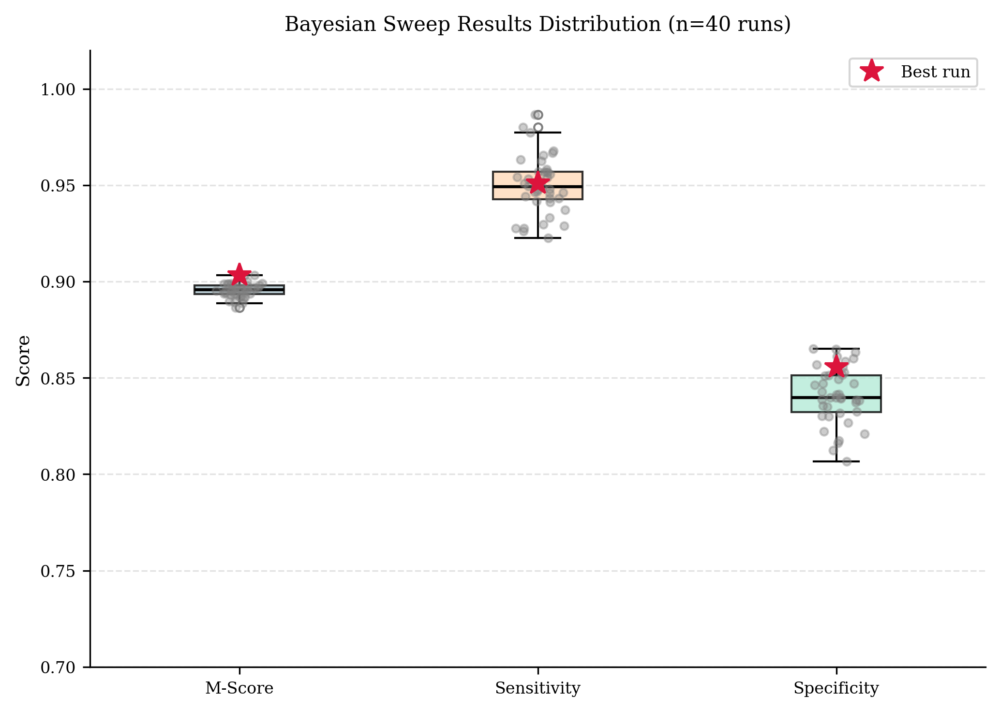
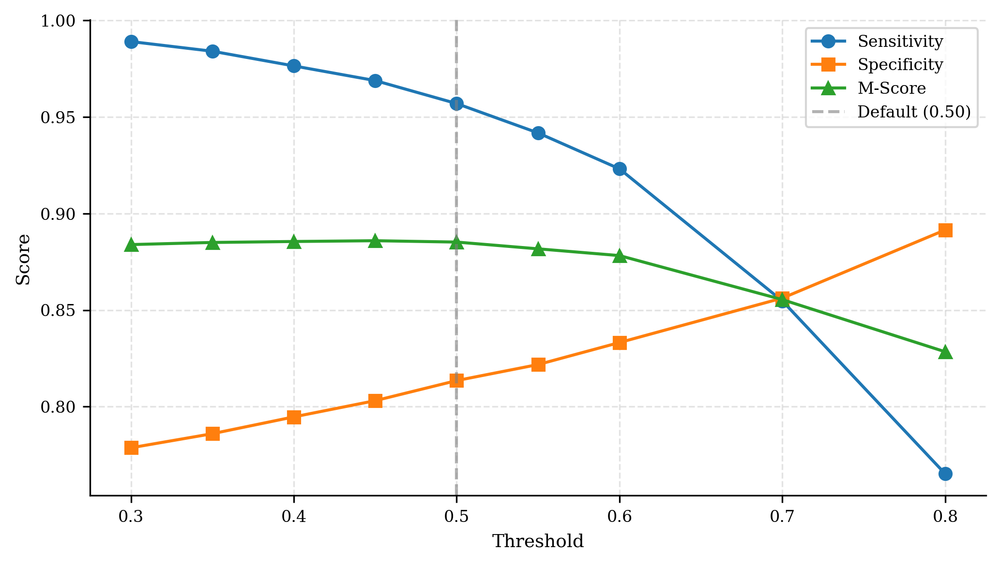

## TITLE PAGE

**[PLACEHOLDER]**

FYP TITLE: Edge AI-Based Heart Sound Diagnosis System

Submitted by: [Student Name]

[Home University and Department]

The final year project work was carried out under the 3+1+1 Educational Framework at the National University of Singapore (Suzhou) Research Institute

**May 2026**

---

## ABSTRACT

**[TODO — 约 300 字，涵盖：研究目标、方法、主要结果]**

---

## ACKNOWLEDGMENTS

**[TODO — 致谢导师、数据集来源等]**

---

## CONTENTS

> *Page numbers to be filled after final typesetting.*

ABSTRACT … i

ACKNOWLEDGEMENTS … ii

CONTENTS … iii

LIST OF FIGURES … iv

LIST OF TABLES … v

LIST OF SYMBOLS AND ABBREVIATIONS … vi

**CHAPTER 1 INTRODUCTION** … X
- 1.1 Background and Motivation … X
- 1.2 Problem Statement … X
- 1.3 Objectives and Contributions … X
- 1.4 Thesis Organisation … X

**CHAPTER 2 RELATED WORK** … X
- 2.1 Heart Sound Classification … X
- 2.2 Lightweight CNN Architectures for Edge Deployment … X
- 2.3 Attention Mechanisms in CNN … X
- 2.4 TinyML and Edge AI … X

**CHAPTER 3 DATASET AND PREPROCESSING** … X
- 3.1 Datasets … X
- 3.2 Signal Preprocessing Pipeline … X
- 3.3 Data Augmentation and Class Balancing … X

**CHAPTER 4 MODEL DESIGN** … X
- 4.1 Overall Architecture … X
- 4.2 Lightweight CNN Backbone … X
- 4.3 Coordinate Attention Module … X
- 4.4 Signal Quality Assessment Model … X
- 4.5 Model Quantization … X

**CHAPTER 5 TRAINING AND EXPERIMENTS** … X
- 5.1 Training Configuration … X
- 5.2 Diagnostic Model Results … X
  - 5.2.1 Training Progression … X
  - 5.2.2 Hyperparameter Search … X
  - 5.2.3 Decision Threshold Analysis … X
- 5.3 SQA Model Results … X
- 5.4 Ablation Study … X
- 5.5 Quantization Impact … X

**CHAPTER 6 EDGE DEPLOYMENT** … X
- 6.1 System Architecture Overview … X
- 6.2 Real-Time Inference Pipeline … X
- 6.3 Performance Evaluation … X
- 6.4 User Interface … X
- 6.5 System Reliability … X

**CHAPTER 7 CONCLUSION** … X
- 7.1 Summary of Contributions … X
- 7.2 Limitations … X
- 7.3 Future Work … X

REFERENCES … X

---

## LIST OF FIGURES

> *Page numbers to be filled after final typesetting.*

| Figure    | Caption                                                                                                                                                                                                    | Page |
| --------- | ---------------------------------------------------------------------------------------------------------------------------------------------------------------------------------------------------------- | ---- |
| Fig. 3.1  | Preprocessing pipeline applied to a representative heart sound recording. (a) Raw waveform; (b) after 25–400 Hz bandpass filtering; (c) first 2-second segment; (d) resulting Log-Mel spectrogram (64×64). | X    |
| Fig. 3.2  | Log-Mel spectrograms for a Normal (left) and Abnormal (right) recording after full preprocessing.                                                                                                          | X    |
| Fig. 4.1  | Cascaded dual-model inference pipeline.                                                                                                                                                                    | X    |
| Fig. 4.2  | Standard convolution vs depthwise separable convolution.                                                                                                                                                   | X    |
| Fig. 4.3  | LightweightCNN architecture visualisation.                                                                                                                                                                 | X    |
| Fig. 4.4  | Comparison of channel and spatial attention mechanisms: SE block, CBAM, and CoordAtt.                                                                                                                      | X    |
| Fig. 4.5  | Coordinate Attention mechanism structure.                                                                                                                                                                  | X    |
| Fig. 4.6  | Integration of Coordinate Attention into depthwise separable convolution blocks.                                                                                                                           | X    |
| Fig. 5.1  | Confusion matrix structure and evaluation metrics (Se, Sp, M-Score).                                                                                                                                       | X    |
| Fig. 5.2  | Training loss and validation M-Score across epochs for Run 6 (final diagnostic model).                                                                                                                     | X    |
| Fig. 5.3  | Confusion matrix for the final diagnostic model (Run 6) on the test set. Left: Pi (INT8); Right: training machine (FP32).                                                                                  | X    |
| Fig. 5.4  | Distribution of validation M-Score across all 40 hyperparameter sweep trials.                                                                                                                              | X    |
| Fig. 5.5  | Validation M-Score for the top-performing sweep configurations.                                                                                                                                            | X    |
| Fig. 5.6  | Se, Sp, and M-Score as a function of classification threshold on the Run 1 test set.                                                                                                                       | X    |
| Fig. 5.7  | SQA model M-Score, Se, and Sp across three training runs.                                                                                                                                                  | X    |
| Fig. 5.8  | Confusion matrix for the final SQA model (Run 3) on the test set. Left: Pi (INT8); Right: training machine (FP32).                                                                                         | X    |
| Fig. 5.9  | Ablation study — M-Score, Sensitivity, and Specificity across four model configurations.                                                                                                                   | X    |
| Fig. 5.10 | FP32 vs INT8 model size comparison for diagnostic and SQA models.                                                                                                                                          | X    |
| Fig. 6.1  | System architecture overview (ESP32 → BLE → Raspberry Pi 4B inference pipeline).                                                                                                                           | X    |
| Fig. 6.2  | Per-stage inference latency on Pi 4B, FP32 vs INT8 (median of 100 runs).                                                                                                                                   | X    |

---

## LIST OF TABLES

> *Page numbers to be filled after final typesetting.*

| Table | Caption | Page |
|-------|---------|------|
| Table 4.1 | LightweightCNN architecture. Spatial dimensions (H×W) shown after each stage. | X |
| Table 5.1 | Training run comparison. All runs use the same test split. | X |
| Table 5.2 | Top 3 hyperparameter sweep trials (validation M-Score). | X |
| Table 5.3 | Threshold sweep on Run 1 model (test set). | X |
| Table 5.4 | Ablation study results. All variants trained on the same fixed test split. | X |
| Table 5.5 | FP32 vs quantized model comparison (diagnostic model, Pi 4B, per-slice, n=6273). | X |
| Table 5.6 | SQA model — validation M-Score across training epochs (Run 1 baseline). | X |
| Table 5.7 | SQA model — three-run progression. | X |
| Table 5.8 | Final SQA model (Run 3) vs diagnostic model (Run 6). | X |
| Table 6.1 | Per-stage inference latency on Pi 4B (single 2-second segment, median of 100 runs). | X |
| Table 6.2 | Resource utilisation during a continuous session (single 20-second chunk, INT8 models). | X |
| Table 6.3 | Quantization accuracy impact on Pi 4B (diagnostic model, decoupled, per-slice, n=6273). | X |

---

## LIST OF SYMBOLS AND ABBREVIATIONS

| Symbol / Abbreviation | Description                                                                   |
| --------------------- | ----------------------------------------------------------------------------- |
| Se                    | Sensitivity = TP / (TP + FN)                                                  |
| Sp                    | Specificity = TN / (TN + FP)                                                  |
| M-Score               | (Se + Sp) / 2; primary evaluation metric of the PhysioNet/CinC 2016 Challenge |
| SQA                   | Signal Quality Assessment                                                     |
| DSC                   | Depthwise Separable Convolution                                               |
| CoordAtt              | Coordinate Attention                                                          |
| BLE                   | Bluetooth Low Energy                                                          |
| TFLite                | TensorFlow Lite                                                               |
| FP32                  | 32-bit floating-point representation                                          |
| INT8                  | 8-bit integer quantization                                                    |
| CNN                   | Convolutional Neural Network                                                  |
| ESP32                 | Espressif ESP32 microcontroller                                               |
| Pi / RPi 4B           | Raspberry Pi 4 Model B                                                        |
| PCM                   | Pulse-Code Modulation                                                         |
| RSS                   | Resident Set Size                                                             |

---

## TODO

### 需要写的章节
- [ ] **Chapter 1** — Introduction（motivation、contribution list、chapter outline）
- [ ] **Chapter 2** — Related Work（已有心音分类方法综述、Edge AI/TinyML、本文方法定位）
- [ ] **Chapter 7** — Conclusion（7.1 Summary of Contributions / 7.2 Limitations / 7.3 Future Work）

### 需要补充的对比内容
- [ ] **SOTA 对比表** — 在 PhysioNet 2016 上与已发表方法横向对比（M-Score / Se / Sp / 参数量 / 部署设备）

### 写完后清理
- [ ] 删除各节开头的中文 bullet note（规划时留下的，正文已写完可删）

---

## Chapter 3: Dataset and Preprocessing

### 3.1 Datasets

Both the diagnostic model and the SQA model are trained on data derived from the PhysioNet/CinC Challenge 2016 heart sound database [1], which comprises recordings collected from clinical and non-clinical environments across six subsets (training-a through training-f). Each recording is accompanied by a REFERENCE.csv file (binary diagnostic label: Normal / Abnormal) and a REFERENCE-SQI.csv file (signal quality index score). The two models use different label sources and class definitions from this common pool, as summarised in Table 3.1.

**Table 3.1: Dataset summary for the diagnostic and SQA models.**

| | Diagnostic Model | SQA Model |
|---|---|---|
| Label source | REFERENCE.csv | REFERENCE-SQI.csv |
| Positive class (label = 1) | Abnormal | Bad Quality (SQI = 0) |
| Negative class (label = 0) | Normal | Good Quality (SQI ≠ 0) |
| Total recordings | 2,876 | 3,240 |
| Class ratio (neg:pos) | ~4:1 (2,304 / 572) | ~8:1 (2,876 / 364) |
| Total segments (after 3.2) | 62,003 | 68,104 |
| Train / Val / Test segments | 49,833 / 5,897 / 6,273 | 54,842 / 6,536 / 6,726 |

For the diagnostic dataset, recordings with SQI = 0 are excluded prior to training, as they are acoustically unusable. For the SQA dataset, these same recordings are retained—they constitute the Bad Quality (positive) class. The SQA label convention is inverted relative to the raw SQI annotation so that Sensitivity in M-Score measures the Bad Quality detection rate, the operationally critical quantity: an undetected bad-quality segment propagates noise directly into the diagnostic stage.

Both datasets are partitioned at the recording level (all segments from a given recording appear in exactly one split) using a fixed random seed (seed = 42), preventing data leakage. Test set filenames are persisted to disk on the first training run and held fixed throughout all experiments.

### 3.2 Signal Preprocessing Pipeline
> *The pipeline described below applies identically to both the diagnostic and SQA datasets.*

All recordings are resampled to 2,000 Hz, sufficient to capture the diagnostically relevant range of heart sounds (20–600 Hz) while minimising storage and computation. Each recording then passes through three stages (Figure 3.1):

**Bandpass filtering.** A 5th-order Butterworth bandpass filter (25–400 Hz) is applied via zero-phase forward-backward filtering (`scipy.signal.filtfilt`). The 25 Hz lower cutoff suppresses baseline wander and motion artefacts; the 400 Hz upper cutoff removes noise above the dominant energy range of S1, S2, and common murmurs. Zero-phase filtering preserves the temporal positions of cardiac events.

**Sliding window segmentation.** Each filtered recording is divided into fixed-length 2-second segments (4,000 samples) with 50% overlap (hop size = 2,000 samples). Segments shorter than 2 seconds at recording boundaries are zero-padded. The 50% overlap ensures cardiac events near a window boundary are fully captured in at least one adjacent window.

**Log-Mel spectrogram.** Each 2-second segment is transformed into a log-Mel spectrogram using the librosa library (256-point FFT, hop length 128, 64 Mel filter banks spanning 25–400 Hz, power = 2.0). The time axis is padded or trimmed to a fixed 64 frames, yielding a 64×64 feature map as the final model input of shape 1×64×64.


**Figure 3.1: Preprocessing pipeline applied to a representative heart sound recording. (a) Raw waveform; (b) after 25–400 Hz bandpass filtering; (c) first 2-second segment; (d) resulting Log-Mel spectrogram (64×64).**


**Figure 3.2: Log-Mel spectrograms for a Normal (left) and Abnormal (right) recording after full preprocessing.**


### 3.3 Data Augmentation and Class Balancing

**Class balancing.** `WeightedRandomSampler` is applied at the DataLoader level for both datasets, assigning each sample a weight inversely proportional to its class frequency. This produces balanced mini-batches without modifying the underlying data distribution, directly counteracting the 4:1 and 8:1 imbalances.

**Waveform augmentation.** Five stochastic augmentations are applied in sequence to each training segment at load time; validation and test splits receive no augmentation. All operations act on the raw waveform prior to Mel spectrogram extraction.

| Operation | Description | Probability |
|-----------|-------------|:-----------:|
| Random gain | Amplitude scaling ∈ [0.8, 1.2] | 0.5 |
| Gaussian noise | Additive white noise, SNR ∈ [20, 35] dB | 0.5 |
| Time shift | Circular shift by up to ±10% of segment length | 0.5 |
| Random resampling | Time-stretch by factor ∈ [0.9, 1.1], re-padded to original length | 0.3 |
| Polarity inversion | Multiply waveform by −1 | 0.5 |

Together these operations simulate variability in probe placement, ambient noise, and heart rate fluctuations encountered in uncontrolled home environments.

---

## Chapter 4: Model Design

### 4.1 Overall Architecture
- 双模型设计思路（SQA + 诊断解耦）
- 输入格式（1×64×64 Log-Mel 频谱图）

The system deploys two independent model instances in a cascaded inference pipeline: a Signal Quality Assessment (SQA) model and a diagnostic model. Both share the same network architecture but are trained on separate datasets for distinct binary classification tasks.

The SQA model serves as a gating function. Before any cardiac recording reaches the diagnostic stage, the SQA model evaluates each 2-second segment for acoustic usability. Segments contaminated by motion artefacts, ambient noise, or insufficient probe contact are rejected; only segments classified as high-quality are forwarded for diagnosis. The final diagnostic decision is produced by aggregating predictions across all accepted segments via weighted averaging, reducing sensitivity to any single noisy window.

This decoupled design has two practical advantages. First, it prevents corrupted input from directly biasing the diagnostic output—a critical concern for a device used in uncontrolled home environments. Second, training the two models independently allows each to be optimised for its own class distribution and evaluation criterion, rather than forcing a single model to solve both problems jointly.

Both models accept a log-Mel spectrogram of shape 1×64×64 as input: one channel, 64 Mel frequency bins spanning 25–400 Hz, and 64 time frames corresponding to a 2-second segment at 2 kHz sampling rate with 128-sample hop length. The compact representation keeps inference memory within the constraints of the Raspberry Pi 4B while retaining the frequency-temporal structure that distinguishes normal S1/S2 patterns from pathological sounds.


**Figure 4.1: Cascaded dual-model inference pipeline. An input recording is first evaluated by the SQA model (Model 0); segments of insufficient quality are rejected as "Unsure", while high-quality segments are forwarded to the diagnostic model (Model 1) which produces a Normal or Abnormal classification.**

### 4.2 Lightweight CNN Backbone
- Depthwise Separable Convolution 结构
- 各层设计（通道数、卷积核大小）
- 参数量分析

The backbone is a four-stage convolutional network built around the depthwise separable convolution (DSC) primitive [2]. A DSC block factorises a standard k×k convolution into two sequential operations: a depthwise convolution that filters each input channel independently with a k×k kernel, followed by a pointwise (1×1) convolution that mixes channels. For $C_\text{in}$ input channels, $C_\text{out}$ output channels, and kernel size $k$, this reduces the parameter count from $C_\text{in} \times C_\text{out} \times k^2$ to $C_\text{in} \times k^2 + C_\text{in} \times C_\text{out}$—a factor of approximately $k^2 = 9$ for 3×3 kernels. This makes DSC well-suited to edge deployment where model size directly determines both storage footprint and inference latency.


**Figure 4.2: Standard convolution vs depthwise separable convolution. A standard k×k convolution (top) convolves all $C_\text{in}$ input channels simultaneously; a DSC (bottom) factors this into a per-channel depthwise convolution followed by a 1×1 pointwise convolution that mixes channels, reducing the parameter count by a factor of approximately $k^2$. Figure reproduced from [3].**

The network begins with a single standard 3×3 convolutional layer that projects the single-channel input to 32 feature maps. This initial layer uses a full convolution because the input has only one channel, making the depthwise factorisation trivial. Three subsequent DSC stages progressively double the channel count while halving the spatial resolution via 2×2 max-pooling. A global average pooling layer collapses the spatial dimensions to a 256-dimensional vector, which passes through a dropout layer (rate 0.3) and a linear classifier.

**Table 4.1: LightweightCNN architecture. Spatial dimensions (H×W) are shown after each stage.**

| Stage | Operation | Channels (in→out) | Spatial (H×W) |
|---|---|---|---|
| conv1 | Conv2d 3×3, BN, ReLU | 1 → 32 | 64 × 64 |
| layer2 | DSC 3×3 + CoordAtt, MaxPool2d | 32 → 64 | 32 × 32 |
| layer3 | DSC 3×3 + CoordAtt, MaxPool2d | 64 → 128 | 16 × 16 |
| layer4 | DSC 3×3 + CoordAtt, MaxPool2d | 128 → 256 | 8 × 8 |
| global\_pool | AdaptiveAvgPool2d(1,1) | 256 | 1 × 1 |
| classifier | Dropout(0.3), Linear | 256 → 2 | — |

The total trainable parameter count is approximately 65.12K. The quantized INT8 TFLite model occupies 144.7 KB on disk.


**Figure 4.3: LightweightCNN architecture visualisation. Each block represents one convolutional stage; spatial dimensions decrease from left to right (64×64 → 32×32 → 16×16 → 8×8) while the number of feature channels doubles at each stage (32 → 64 → 128 → 256). CoordAtt is inserted after the pointwise convolution at each DSC stage. The final arrow denotes global average pooling followed by the linear classifier.**

### 4.3 Coordinate Attention Module
- 设计动机（为什么用 CoordAtt 而不是 SE Block）
- 模块结构（H/W 方向分离的空间注意力）
- 在模型中的插入位置

Each DSC block in layers 2–4 integrates a Coordinate Attention (CoordAtt) module [4] inserted after the pointwise convolution.

The design choice is motivated by a limitation of the Squeeze-and-Excitation (SE) block [5], the most widely adopted channel attention mechanism. SE computes a global descriptor by average-pooling the entire spatial feature map into a single C-dimensional vector, then uses it to rescale channel responses. This operation is spatially blind: it encodes which channels matter globally but discards where within the feature map the relevant activations occur. For heart sound spectrograms, spatial position carries diagnostic information. S1 and S2 energy concentrates in specific frequency bands (predominantly below 200 Hz) and at characteristic temporal positions within the cardiac cycle; pathological murmurs occupy frequency ranges that differ from normal sounds. An attention mechanism that ignores spatial structure cannot selectively amplify these localised cues.

![[Paper Photo/Comparison to Squeeze-and-Excitation block abd CBAM.png]]
**Figure 4.4: Comparison of channel and spatial attention mechanisms. (a) SE block: global average pooling collapses the entire spatial map into a single C-dimensional descriptor, discarding positional information. (b) CBAM: augments SE with a spatial branch that uses channel pooling and a 7×7 convolution. (c) CoordAtt: decomposes pooling independently along H and W axes, preserving positional context along each direction. Figure reproduced from Hou et al. [4].**


CoordAtt retains positional information by decomposing spatial pooling along the two axes independently. Given a feature map $\mathbf{X} \in \mathbb{R}^{N \times C \times H \times W}$, the module proceeds as follows:

1. **Directional pooling.** $\mathbf{X}$ is pooled along the width axis to produce $\mathbf{X}_h \in \mathbb{R}^{N \times C \times H \times 1}$ (encoding frequency-axis context) and along the height axis to produce $\mathbf{X}_w \in \mathbb{R}^{N \times C \times 1 \times W}$ (encoding time-axis context). Unlike global average pooling, each element retains its position along the non-pooled axis.

2. **Joint encoding.** $\mathbf{X}_h$ and $\mathbf{X}_w$ (transposed to align the spatial dimension) are concatenated along the height axis and passed through a shared 1×1 convolution followed by BatchNorm and ReLU. The intermediate channel dimension is $m = \max(8, \lfloor C/16 \rfloor)$, giving $m = 8, 8, 16$ for $C = 64, 128, 256$ at layers 2, 3, 4 respectively.

3. **Attention map generation.** The encoded tensor is split back into height- and width-specific components. Each is projected by a separate 1×1 convolution and sigmoid to produce $\mathbf{a}_h \in [0,1]^{N \times C \times H \times 1}$ and $\mathbf{a}_w \in [0,1]^{N \times C \times 1 \times W}$.

4. **Recalibration.** The output is $\mathbf{X} \cdot \mathbf{a}_h \cdot \mathbf{a}_w$. Because $\mathbf{a}_h$ varies along the frequency axis and $\mathbf{a}_w$ varies along the time axis, their elementwise product creates a 2D attention map that weights each spatial location according to both frequency and temporal position—without collapsing either axis.

![[Paper Photo/Coordinate-Attention.png]]
**Figure 4.5: Coordinate Attention mechanism structure. The input feature map is pooled along the height and width axes independently (X Avg Pool, Y Avg Pool), concatenated and jointly encoded via a shared 1×1 convolution, then split and projected with separate sigmoid activations to produce axis-specific attention weights. Figure reproduced from Cao et al. [6].**

![[Paper Photo/How to plug the proposed CA block in the inverted residual block abd the sunglass block.png]]
**Figure 4.6: Integration of Coordinate Attention into depthwise separable convolution blocks. (a) CA inserted after the depthwise convolution in an inverted residual block; (b) CA inserted after the depthwise convolution in a plain DSC block, as used in this work. Figure reproduced from Hou et al. [4].**

The additional parameter cost per CoordAtt block is small: approximately 1.6K, 3.1K, and 12.3K at layers 2, 3, and 4 respectively, modest relative to the DSC blocks they augment.

### 4.4 Signal Quality Assessment Model

A joint multi-task formulation with a shared backbone and two classification heads was considered but rejected on the grounds of feature conflict. Acoustic artefacts in low-quality recordings—broadband noise, contact friction, and motion transients—produce spectrogram patterns that partially overlap with pathological murmurs in the mid-frequency range. Under joint training, the SQA and diagnostic objectives would impose conflicting gradient signals on the shared representation for this overlapping pattern class, likely degrading both tasks. Training the two models independently allows each to develop a representation optimised for its own label space without interference.

The SQA model therefore shares the same LightweightCNN + CoordAtt architecture as the diagnostic model—identical backbone, attention integration, and classifier head—and is trained independently on the quality-labelled dataset described in Section 3.1. Using a shared architecture means both models run under the same TFLite inference pipeline on the Raspberry Pi with no additional engineering overhead. At inference time, the SQA model produces a Good-Quality probability P(Good) ∈ [0, 1] per segment; this value is used directly as a continuous weight in the diagnostic aggregation step rather than as a binary gate, so borderline-quality segments down-weight the final result rather than being discarded entirely.

### 4.5 Model Quantization
- FP32 → INT8 量化方案（Post-Training Quantization）
- TFLite 转换流程
- 量化对模型大小的影响

Both models are converted to TFLite format using the `ai_edge_torch` library, which compiles a PyTorch model directly to a TFLite flatbuffer without an intermediate ONNX step. Two variants are produced per model: an FP32 baseline and a quantized version using dynamic range quantization (`tf.lite.Optimize.DEFAULT`).

Dynamic range quantization statically converts all weight tensors from FP32 to INT8 at export time, reducing the weight storage footprint by approximately 4×. Activations are not statically quantized; instead, their ranges are computed dynamically per inference call. This approach requires no calibration dataset, making it straightforward to apply to any trained checkpoint. The trade-off relative to full integer quantization—where both weights and activations are fixed at INT8—is that activation quantization overhead occurs at runtime rather than being amortized.

The resulting quantized models each occupy 144.7 KB on disk. On the ARM Cortex-A72 of the Raspberry Pi 4B, weight-compressed INT8 models reduce memory bandwidth pressure during inference. Quantitative accuracy retention and latency comparisons between the FP32 and quantized variants are reported in Chapter 5.

---

## Chapter 5: Training and Experiments

### 5.1 Training Configuration
- 数据划分（80/10/10，按 recording 分组）
- 超参数设置（Epoch、Batch Size、LR、Scheduler）
- 评估指标说明（Sensitivity、Specificity、M-Score）

All experiments use the same 80/10/10 recording-level split (seed = 42), with the test set filenames persisted to disk on the first run and held fixed throughout. Slices from the same recording never appear across splits, preventing any form of data leakage. WeightedRandomSampler is applied on the training set in all runs to counteract the 4:1 class imbalance.

The model is trained with Adam optimiser, learning rate 1×10⁻³, and a `ReduceLROnPlateau` scheduler (factor = 0.5, patience = 3, monitored on validation M-Score). Early stopping with patience = 10 is applied in all runs except Run 1. The model checkpoint with the highest validation M-Score is saved and used for test evaluation.

**Evaluation metrics.** The PhysioNet/CinC 2016 challenge defines the primary metric as:

$$M\text{-}Score = \frac{Se + Sp}{2}$$

where Sensitivity $Se = \frac{TP}{TP + FN}$ measures the fraction of abnormal recordings correctly identified, and Specificity $Sp = \frac{TN}{TN + FP}$ measures the fraction of normal recordings correctly identified. M-Score is preferred over accuracy because accuracy can reach 80% by predicting all recordings as Normal, while yielding $Se = 0$ and $\text{M-Score} = 0.5$. All models are saved and compared by M-Score.


**Figure 5.1: Confusion matrix structure and evaluation metrics. TP: abnormal correctly identified; FN: abnormal misclassified as normal; FP: normal misclassified as abnormal; TN: normal correctly identified. Sensitivity (Se), Specificity (Sp), and M-Score are derived from these four quantities.**

### 5.2 Diagnostic Model Results
- Run 1 基础训练结果
- Run 2（Label Smoothing + Early Stopping）对比
- 阈值分析

#### 5.2.1 Training Progression

Seven training runs were conducted to isolate the effect of individual design decisions. All runs use the LightweightCNN + CoordAtt architecture (Group C in the ablation study) unless otherwise noted. Table 5.1 summarises the key configurations and test results.

**Table 5.1: Training run comparison. All runs use the same test split. Bold = selected configuration.**

| Run | Batch | n\_mels | hop | Label Smooth | Early Stop | Test M-Score | Test Se | Test Sp |
|-----|-------|---------|-----|:---:|:---:|:---:|:---:|:---:|
| 1 | 16 | 32 | 96 | ✗ | ✗ | 0.8852 | 0.9569 | 0.8135 |
| 2 | 16 | 32 | 96 | ✓ | ✓ | 0.8816 | 0.9181 | 0.8452 |
| 3 | 16 | 32 | 96 | ✓ | ✓ | 0.8828 | 0.9105 | 0.8551 |
| 4 | 256 | 32 | 96 | ✗ | ✓ | 0.8835 | 0.9544 | 0.8125 |
| 5 | 256 | 64 | 128 | ✗ | ✓ | 0.8784 | 0.9409 | 0.8159 |
| 6 (sweep params) | 16 | 64 | 128 | ✗ | ✓ | **0.8903** | **0.9485** | **0.8322** |
| 7 | 16 | 32 | 96 | ✗ | ✓ | 0.8869 | 0.9383 | 0.8355 |

> *Run 3 uses overlap = 0.75 (vs 0.5 in others), held constant as a separate variable.*

Several consistent patterns emerge across runs. First, label smoothing (Run 2 vs Run 4) shifts the Se/Sp balance toward higher Sp at the cost of Se—the Se/Sp gap narrows from 0.143 to 0.073—but produces no meaningful change in M-Score (0.8816 vs 0.8835). Since the home screening use case penalises missed abnormal cases more heavily than false alarms, label smoothing was excluded from subsequent runs. Second, batch size 16 consistently outperforms batch size 256 when holding all other parameters fixed (Run 6 vs Run 5: +0.012 M-Score; Run 7 vs Run 4: +0.003), likely because smaller batches provide noisier but more frequent gradient updates that regularise training. Third, overlap = 0.75 (Run 3) produces no meaningful improvement over overlap = 0.5 at the same configuration.

**Run 6** achieves the highest test M-Score (0.8903) and is selected as the final model. Its preprocessing parameters (n\_mels = 64, hop = 128) were identified by a 40-trial Bayesian hyperparameter search (Section 5.2.2), and the batch size was set to 16 based on the empirical comparison above.


**Figure 5.2: Training loss and validation M-Score across epochs for Run 6 (final diagnostic model).**


**Figure 5.3: Confusion matrix for the final diagnostic model (Run 6) on the test set. Left: evaluated on Pi (INT8); Right: evaluated on training machine (FP32).**

#### 5.2.2 Hyperparameter Search

A Bayesian sweep over 40 trials was conducted using Weights & Biases, optimising for validation M-Score. The search space covered n\_mels ∈ {32, 64}, hop\_length ∈ {64, 96, 128}, n\_fft ∈ {128, 256, 512}, overlap ∈ {0.25, 0.5, 0.75}, learning rate ∈ {3×10⁻⁴, 5×10⁻⁴, 1×10⁻³}, and weight\_decay ∈ {1×10⁻⁴, 1×10⁻³}.

**Table 5.2: Top 3 sweep trials (validation M-Score).**

| Rank | Val M-Score | Val Se | Val Sp | n\_mels | hop | n\_fft | overlap | lr | weight\_decay |
|------|:-----------:|:------:|:------:|:-------:|:---:|:------:|:-------:|:--:|:-------------:|
| 1 | 0.9033 | 0.9510 | 0.8556 | 64 | 128 | 256 | 0.75 | 1e-3 | 1e-3 |
| 2 | 0.9031 | 0.9677 | 0.8386 | 64 | 96 | 256 | 0.75 | 1e-3 | 1e-3 |
| 3 | 0.9000 | 0.9539 | 0.8462 | 64 | 128 | 256 | 0.75 | 1e-3 | 1e-3 |

The configuration $n_\text{mels}$ = 64, $n_\text{fft}$ = 256, overlap = 0.75, lr = 1×10⁻³ appears consistently across the top trials, indicating a stable optimal region. The selected parameters for the final model are $n_\text{mels}$ = 64, hop length = 128, $n_\text{fft}$ = 256, weight decay = 1×10⁻³.


**Figure 5.4: Distribution of validation M-Score across all 40 hyperparameter sweep trials.**


**Figure 5.5: Validation M-Score for the top-performing sweep configurations.**

#### 5.2.3 Decision Threshold Analysis

The default classification threshold of 0.5 was evaluated against a sweep from 0.30 to 0.80 on the Run 1 model. Results are shown in Table 5.3.

**Table 5.3: Threshold sweep on Run 1 model (test set).**

| Threshold | Se | Sp | M-Score |
|:---------:|:--:|:--:|:-------:|
| 0.30 | 0.9890 | 0.7787 | 0.8839 |
| 0.35 | 0.9840 | 0.7860 | 0.8850 |
| 0.40 | 0.9764 | 0.7947 | 0.8855 |
| **0.45** | **0.9688** | **0.8031** | **0.8859** |
| 0.50 | 0.9569 | 0.8135 | 0.8852 |
| 0.55 | 0.9417 | 0.8218 | 0.8817 |
| 0.60 | 0.9231 | 0.8332 | 0.8782 |
| 0.70 | 0.8547 | 0.8562 | 0.8554 |
| 0.80 | 0.7652 | 0.8915 | 0.8284 |

The optimal threshold (0.45) improves M-Score by only 0.0007 over the default 0.50, confirming that the Se/Sp imbalance is a property of the learned decision boundary rather than a post-processing artefact. The default threshold of 0.50 is retained for deployment, as it provides the highest Se (0.9569), which is the more clinically critical metric in a home screening context.


**Figure 5.6: Se, Sp, and M-Score as a function of classification threshold on the Run 1 test set.**

### 5.3 SQA Model Results
- 训练结果（Test M-Score / Se / Sp）

The SQA model shares the same LightweightCNN + CoordAtt architecture (65.12K parameters) and training hyperparameters as the final diagnostic model (batch = 16, early stopping patience = 10). The dataset is `metadata_quality_reversed.csv` (3,240 recordings, Bad:Good = 364:2,876), split 80/10/10 by recording, yielding 54,842 training, 6,536 validation, and 6,726 test segments. Preprocessing uses the final configuration (n\_mels = 64, hop = 128). Three training runs were conducted to progressively address the Se deficit caused by the more severe 8:1 class imbalance.

**Table 5.6: SQA model — validation M-Score across training epochs (Run 1 baseline).**

| Epoch | Val Se (Bad) | Val Sp (Good) | Val M-Score |
|:-----:|:------------:|:-------------:|:-----------:|
| 1 | 0.7409 | 0.8592 | 0.8000 |
| 3 | 0.7263 | 0.8826 | 0.8044 |
| 9 | 0.7172 | 0.9036 | 0.8104 |
| **12** | **0.7281** | **0.9050** | **0.8165** ← best |
| 22 | 0.6825 | 0.9377 | 0.8101 (early stop) |

**Run 1** (lr = 1×10⁻³, CrossEntropyLoss, dropout = 0.3) establishes the baseline. Validation M-Score oscillates noticeably across epochs (0.78–0.82), a sign of unstable training under the 8:1 imbalance. Test Se = 0.7173: 28.3% of bad-quality segments pass through to the diagnostic model undetected.

**Run 2** adds an explicit class weight of [1, 8] to the loss function and reduces the learning rate to 5×10⁻⁴ (scheduler patience raised from 3 to 5). The loss weighting directly penalises missed Bad-class predictions more heavily. Val oscillation narrows (0.80–0.83), and test Se improves to 0.7651 (+0.048). Sp drops to 0.8554 as expected from the stronger minority-class bias.

**Run 3** increases dropout from 0.3 to 0.5, retaining all other Run 2 changes. The heavier regularisation reduces overfitting on the small Bad-class population: test Se reaches 0.8274 (+0.062 over Run 2), and the train/val loss gap narrows. The best validation checkpoint now appears at Epoch 2—earlier convergence than Run 2—after which M-Score declines monotonically to early-stop at Epoch 12. Run 3 is selected as the final SQA model.

**Table 5.7: SQA model — three-run progression.**

| Metric | Run 1 | Run 2 | **Run 3 (final)** | Run 1→3 change |
|--------|:-----:|:-----:|:-----------------:|:--------------:|
| Test M-Score | 0.8046 | 0.8102 | **0.8152** | +0.011 |
| Test Se (Bad) | 0.7173 | 0.7651 | **0.8274** | +0.110 |
| Test Sp (Good) | 0.8919 | 0.8554 | 0.8029 | −0.089 |
| Test Accuracy | 0.8794 | 0.8489 | 0.8046 | — |
| Best Val Se | 0.7281 | 0.8120 | 0.8759 | +0.148 |
| Val→Test Se gap | −0.011 | −0.047 | −0.048 | stable ~0.05 |
| Early stop epoch | 22 | 22 | 12 | faster |

**Table 5.8: Final SQA model (Run 3) vs diagnostic model.**

| Metric | Diagnostic Model (Run 6) | SQA Model (Run 3) |
|--------|:------------------------:|:-----------------:|
| Test M-Score | 0.8903 | 0.8152 |
| Test Se | 0.9485 | 0.8274 |
| Test Sp | 0.8322 | 0.8029 |
| Test Accuracy | 0.8541 | 0.8046 |
| Class imbalance | 4:1 | 8:1 |


**Figure 5.7: SQA model M-Score, Se, and Sp across three training runs.**


**Figure 5.8: Confusion matrix for the final SQA model (Run 3) on the test set. Left: evaluated on Pi (INT8); Right: evaluated on training machine (FP32).**

The persistent Val→Test Se gap of approximately 0.048 across Runs 2 and 3 indicates that the generalisation ceiling is constrained by the small Bad-class population (364 recordings total; roughly 36 recordings in the test split), rather than by the training configuration. Further Se improvement would require additional bad-quality data. The Sp of 0.8029 means approximately 20% of good-quality recordings receive a lower P(Good) weight in the inference aggregation; this reduces effective signal volume but does not introduce noise into the diagnostic stage, and is considered acceptable given the deployment context.

### 5.4 Ablation Study
- Baseline CNN（无注意力）
- + Coordinate Attention
- + Residual Connection
- 各步骤指标对比

To quantify the contribution of each architectural component, four model variants were trained under identical conditions: the same dataset split, preprocessing parameters ($n_\text{mels}$ = 32, hop length = 96, $n_\text{fft}$ = 256, overlap = 0.5), training hyperparameters (batch = 16, lr = 1×10⁻³, weight decay = 1×10⁻⁴, early stopping patience = 10), and class balancing strategy. The variants form a cumulative chain, each adding one modification to the previous.

**Table 5.4: Ablation study results. All variants trained on the same fixed test split.**

| Config | Params | Test M-Score | Test Se | Test Sp | Test Acc | Best Epoch |
|--------|-------:|:------------:|:-------:|:-------:|:--------:|:----------:|
| A: Baseline (16→32→64→128, no attention) | 12.87K | 0.8851 | 0.9654 | 0.8049 | 0.8352 | 1 |
| B: + Wider channels (32→64→128→256) | 47.23K | 0.8896 | 0.9595 | 0.8198 | 0.8462 | 1 |
| C: + CoordAtt + Dropout(0.3) | 65.12K | 0.8869 | 0.9383 | 0.8355 | 0.8549 | 5 |
| D: + Residual connections | 108.10K | **0.8912** | **0.9797** | 0.8027 | 0.8361 | 2 |

**A → B: Wider channels.** Doubling the channel width throughout (+0.005 M-Score) improves both Se and Sp marginally. The best epoch remains 1, indicating that the model still overfits rapidly and that increased capacity alone does not improve training dynamics.

**B → C: CoordAtt + Dropout.** Adding Coordinate Attention and Dropout (rate 0.3) produces the most notable change in training behaviour: the best validation epoch shifts from 1 to 5, indicating substantially better regularisation. M-Score decreases slightly (−0.003) relative to B, but Sp increases by +0.016 and the Se/Sp gap narrows from 0.134 to 0.103. The contribution of CoordAtt is therefore more accurately characterised as improved training stability and better Se/Sp balance than raw M-Score gain.

**C → D: Residual connections.** Residual connections yield the highest test M-Score (0.8912, +0.004 over C), driven by a large Se increase (+0.041). However, Sp drops to 0.8027—lower than any other variant—and the best epoch regresses to 2, suggesting that residual connections accelerate convergence at the cost of reinforcing the model's tendency to over-predict Abnormal. The Se/Sp gap widens to 0.177.


**Figure 5.9: Ablation study — M-Score, Sensitivity, and Specificity across four model configurations.**

**Architecture selection.** Config C is selected as the final architecture. While D achieves the highest M-Score, its Se/Sp imbalance (0.177 gap) is worse than A (0.161) and substantially worse than C (0.103). In a home screening device where missed abnormal cases carry greater clinical risk than false alarms, Se is more important than Sp—but the magnitude of Sp degradation in D (0.8027, a 32.8% false alarm rate on normal recordings) is considered unacceptable for a practical device. Config C provides the best balance across all three criteria: Se/Sp balance, training stability, and parameter efficiency.

### 5.5 Quantization Impact

Post-training quantization is applied to both models via dynamic range quantization (`tf.lite.Optimize.DEFAULT`), which statically converts all weight tensors from FP32 to INT8 at export time while leaving activations in floating point. The resulting INT8 models each occupy 144.7 KB on disk, a reduction of 52.2% from the 302.8 KB FP32 baseline—consistent with the expected weight-only compression ratio for this architecture.

**Table 5.5: FP32 vs quantized model comparison (diagnostic model, Pi 4B, per-slice, n=6273).**

| Metric | FP32 | Quantized (Dynamic Range INT8) | Change |
|--------|:----:|:------------------------------:|:------:|
| Model size | 302.8 KB | 144.7 KB | −52.2% |
| Test M-Score | 87.1% | 87.0% | −0.1% |
| Test Se | 91.7% | 91.7% | 0.0% |
| Test Sp | 82.4% | 82.3% | −0.1% |
| Inference latency (Pi 4B) | 13.44 ms | 13.43 ms | −0.1% |

Accuracy degradation is negligible: M-Score drops by only 0.1 percentage point (87.1% → 87.0%), Sensitivity is unchanged at 91.7%, and Specificity decreases by 0.1 points (82.4% → 82.3%). These differences are within the expected rounding variation of per-slice evaluation and do not represent a meaningful accuracy loss.

The latency reduction is similarly marginal (13.44 ms → 13.43 ms, −0.1%). This is expected for dynamic range quantization, which compresses weights to INT8 at export time but leaves activations at float32 at runtime. The absence of statically-quantized activations means the ARM Cortex-A72 cannot execute true INT8 GEMM operations; the latency saving comes only from reduced memory bandwidth for weight loading, not from integer arithmetic acceleration. Full integer quantization—where both weights and activations are fixed at INT8—would be needed to realise arithmetic-level speedup.


**Figure 5.10: FP32 vs INT8 model size comparison for diagnostic and SQA models.**

---

## Chapter 6: Edge Deployment

### 6.1 System Architecture Overview

The deployed system consists of two physical units: an ESP32-based acquisition device and a Raspberry Pi 4B inference station, communicating exclusively over Bluetooth Low Energy (BLE). The separation of concerns between the two units is deliberate: the ESP32 handles only signal capture and wireless transmission, keeping its firmware simple and power-efficient, while all computation-intensive processing—filtering, feature extraction, and model inference—runs on the Pi.


**Figure 6.1: System architecture overview. The ESP32 captures audio via I²S, decimates to 2 kHz, and streams PCM data over BLE. The Raspberry Pi 4B receives the stream and runs the full inference pipeline (preprocessing → SQA → diagnostic model), with results stored to WAV/CSV/JSON and displayed on peripheral outputs. A watchdog process ensures continuous operation.**

**ESP32 (acquisition side).** An INMP441 MEMS digital microphone connects to the ESP32 via I²S. The I²S peripheral is configured at 8,000 Hz with 16-bit receive width (the INMP441's native 24-bit output is truncated to the lower 16 bits). Before downsampling, a DC-removal stage (sliding mean over 1,000 samples) eliminates baseline drift, and a 2nd-order IIR anti-aliasing low-pass filter (cutoff ≈ 800 Hz at 8 kHz) is applied to prevent spectral folding. A 4:1 decimation stage then reduces the rate to 2,000 Hz. A 30× digital gain with ±32,767 clipping compensates for the INMP441's low raw output level. The resulting 16-bit PCM samples (little-endian, mono) are placed into a ping-pong double buffer to decouple the sampling timer from the BLE stack, ensuring no samples are dropped at packet boundaries. Each BLE notification carries 128 bytes (64 samples), giving one packet every 32 ms at the 2,000 Hz operating rate. The ESP32 runs a GATT server exposing a single custom notify characteristic (UUID `beb5483e-36e1-4688-b7f5-ea07361b26a8`); after disconnect it immediately restarts advertisement, making reconnection transparent to the user.

**Raspberry Pi 4B (inference side).** The Pi runs a single asyncio event loop (`main_pi.py`) that manages BLE reception, preprocessing, inference, storage, and UI updates concurrently without multi-threading. A `bleak` BLE client subscribes to ESP32 notifications; received bytes accumulate in a bytearray ring buffer. Once 80,000 bytes (40,000 samples = 20 seconds of audio) have arrived, the chunk is placed onto an asyncio queue and handed off to a dedicated inference worker task. Within each 20-second chunk, a sliding window of 2 seconds with 50% overlap (`HOP_SAMPLES = 2,000`) produces 19 overlapping windows; each window is independently preprocessed and scored. The chunk-level label is derived from a quality-weighted average over all windows that pass the SQA check (described in Section 6.2). A background asyncio task refreshes the system-status display every 2 seconds independently of the inference cycle.

### 6.2 Real-Time Inference Pipeline

**Acquisition protocol.** The system operates in continuous streaming mode. Each diagnostic session is initiated by a short button press and runs until the user presses the button again to stop. BLE audio data accumulates in 20-second chunks (`CHUNK_DURATION = 20 s`, `CHUNK_BYTES = 80,000`). Within each chunk, a sliding window of 2 seconds with 50% overlap (`HOP_SAMPLES = 2,000` samples = 1 s) is applied, yielding 19 overlapping windows per chunk. The chunk granularity balances responsiveness against scheduling overhead: each chunk is dispatched as a single unit to the inference worker, keeping the asyncio event loop unblocked during BLE reception while still delivering a fresh result roughly every 20 seconds.

**Preprocessing on-device.** The 20-second chunk (40,000 int16 samples) is converted to float32 by dividing by 32,768, then passed through a 5th-order Butterworth bandpass filter (25–400 Hz, zero-phase) in one pass. Each 2-second sliding window (4,000 samples) is then extracted and peak-normalised independently: the window is divided by its maximum absolute value, preventing any single noise spike from suppressing the entire chunk. Log-Mel spectrogram extraction is applied per window ($n_\text{mels}$ = 64, $n_\text{fft}$ = 256, hop length = 128, $f_\text{min}$ = 25 Hz, $f_\text{max}$ = 400 Hz, power = 2.0). The time axis is zero-padded or trimmed to a fixed length of 64 frames, yielding a 64 × 64 feature map. This is reshaped to tensor shape (1, 1, 64, 64) for TFLite input.

**Cascaded TFLite inference.** Each window is independently processed by two INT8 quantized TFLite models loaded at startup. The SQA model runs first, producing a Good-Quality probability P(Good) ∈ [0, 1]. Windows with P(Good) < 0.6 are rejected as acoustically degraded and excluded from inference. For windows that pass the SQA gate, the diagnostic model runs on the same feature tensor, producing a Normal probability P(Normal) ∈ [0, 1]. The chunk-level result aggregates all valid windows through a quality-weighted average:

$$\text{score} = \frac{\sum_{i} P(\text{Good})_i \cdot P(\text{Normal})_i}{\sum_{i} P(\text{Good})_i}$$

The final label is Normal if score > 0.5, Abnormal otherwise. Down-weighting by SQA score rather than binary rejection means that borderline-quality windows still contribute, but proportionally less than high-quality ones. If no windows in a chunk pass the SQA threshold (P(Good) < 0.6 for all 19 windows), the chunk is reported as low-quality noise and excluded from the session log.

**Data flow summary.**

```
BLE notification (128 B) → accumulate in ring buffer
→ 80,000 bytes complete (= 20 s chunk)
→ offload to inference worker via asyncio.Queue
→ int16 → float32 normalisation (÷ 32768)
→ bandpass filter (Butterworth 25–400 Hz, whole chunk)
→ sliding window (2 s, 50% overlap → 19 windows/chunk)
  └─ per-window peak normalisation (÷ max absolute value)
  └─ log-Mel spectrogram (64 × 64)
  └─ reshape to (1, 1, 64, 64)
  └─ SQA TFLite → P(Good); skip if < 0.6
  └─ Diagnostic TFLite → P(Normal)
  └─ accumulate (P(Good), P(Normal)) pairs
→ chunk result: quality-weighted average → label + confidence
→ OLED update + WAV archive
```

### 6.3 Performance Evaluation

This section reports inference latency, resource utilisation, and quantization accuracy on the Raspberry Pi 4B ARM Cortex-A72. All measurements are taken on-device using `benchmark.py` and `evaluate.py`.

**Table 6.1: Per-stage inference latency on Pi 4B (single 2-second segment, median of 100 runs).**

| Stage | FP32 (ms) | INT8 (ms) |
|-------|:---------:|:---------:|
| Bandpass filter | 2.24 | 2.24 |
| Log-Mel spectrogram | 4.73 | 4.73 |
| SQA model | 13.51 | 13.46 |
| Diagnostic model | 13.44 | 13.43 |
| **Total per segment** | **33.92** | **33.87** |

The bandpass filter and Log-Mel spectrogram are implemented as NumPy operations and are not subject to TFLite quantization; their latency is identical across both configurations. Quantization reduces latency only for the two TFLite model stages, though the improvement is marginal (under 0.1 ms per stage) because dynamic range quantization quantizes weights statically but leaves activations at runtime float, yielding limited arithmetic speedup on the ARM Cortex-A72 compared to full integer quantization.


**Figure 6.2: Per-stage inference latency on Pi 4B, FP32 vs INT8 (median of 100 runs). Preprocessing stages are unaffected by quantization.**

**Table 6.2: Resource utilisation during a continuous session (single 20-second chunk, INT8 models).**

| Metric | Value |
|--------|:-----:|
| Peak CPU utilisation | 1.3% |
| Memory usage (RSS) | 249.9 MB |
| Model file size — SQA INT8 | 144.7 KB |
| Model file size — Diagnostic INT8 | 144.7 KB |
| Model file size — FP32 (each) | 302.8 KB |

**Realtime constraint.** Each 2-second segment must be fully processed before the next segment is complete, i.e., total per-segment latency must remain under 2,000 ms. At the ARM Cortex-A72 clock speed (1.5 GHz) and given the lightweight model size (65.12K parameters, 144.7 KB INT8), the total per-segment latency of 33.9 ms satisfies the real-time constraint with a margin of approximately 59×.

**Table 6.3: Quantization accuracy impact on Pi 4B (diagnostic model, decoupled, per-slice, n=6273).**

| Metric | FP32 | INT8 | Change |
|--------|:----:|:----:|:------:|
| M-Score | 87.1% | 87.0% | −0.1% |
| Sensitivity | 91.7% | 91.7% | 0.0% |
| Specificity | 82.4% | 82.3% | −0.1% |
| Accuracy | 84.2% | 84.1% | −0.1% |

Across all four metrics, INT8 quantization introduces at most 0.1 percentage point of degradation relative to the FP32 baseline evaluated on the same device. Sensitivity—the clinically critical metric for detecting abnormal recordings—is entirely unaffected. These results confirm that dynamic range quantization preserves diagnostic accuracy while reducing each model's storage footprint from 302.8 KB to 144.7 KB, enabling both models to be held simultaneously in the Pi's memory with a combined footprint under 300 KB.

### 6.4 User Interface

The device is designed for unsupervised home use: a user without technical expertise must be able to start a measurement, monitor its progress, and read the result using only the physical controls and onboard displays.

**Physical button.** A single tactile button on GPIO27 (internal pull-up, software debounce 20 ms) provides the sole user input. The interaction model is intentionally minimal:

| Action | Effect |
|--------|--------|
| Short press (standby) | Start a diagnostic session (BLE connect → continuous chunk streaming) |
| Short press (during session) | Abort current session |
| Long press ≥ 3 s | Safe shutdown (OLED confirms → `sudo shutdown -h now`) |

**Primary OLED (128×64, SSD1306).** Connected via hardware I2C (GPIO2/3, bus 1), this display presents diagnostic-facing information across three states:

- *Standby:* Project name, team members, and supervisor; a heart icon blinks at 1 Hz. Prompts the user to press the button.
- *Connecting:* "Connecting ESP32…" with a progress bar that fills over the BLE connection timeout and a live countdown in seconds.
- *Running:* Upper half shows the current chunk number, window progress (e.g., Win: 05/09), and the running Normal probability for the active segment; lower half shows the result and confidence from the previous segment. A heart icon blinks on each valid inference window.

**Secondary OLED (128×32, SSD1306).** Connected via software I2C (GPIO23/24, bus 4, configured via `dtoverlay=i2c-gpio`), this smaller display shows system health metrics (CPU usage, RAM utilisation, CPU temperature), refreshed every 2 seconds by a background asyncio task. It operates independently of the inference cycle and remains active throughout the session, allowing quick identification of resource pressure without interrupting the diagnostic display.

Both displays use the `luma.oled` library. An internal `threading.Lock` in each display class prevents concurrent draw calls from corrupting the framebuffer when the inference callback and the background sysinfo task write simultaneously.

### 6.5 System Reliability

Edge deployment introduces failure modes absent from server environments: intermittent BLE links, unclean power loss, and the absence of an operator to restart crashed processes. Three mechanisms address these.

**Service auto-restart (systemd).** The inference application runs as a systemd unit (`heartbeat.service`) with `Restart=on-failure` and a 10-second restart delay. The service starts after `bluetooth.target` and `network.target`, ensuring the BLE stack is initialised before the application attempts to connect. On boot, the service starts automatically; after any unhandled exception the process is respawned without user intervention.

**Software watchdog.** The main inference loop writes a heartbeat timestamp to `/tmp/heartbeat.ts` every 30 seconds. A separate lightweight watchdog process (`src/watchdog.py`, managed by `watchdog.service`) reads this file every 30 seconds; if the timestamp is more than 90 seconds old—indicating the main loop is frozen rather than merely idle—the watchdog restarts `heartbeat.service` via `systemctl restart`. The 90-second threshold is three times the heartbeat interval, tolerating transient delays from long BLE connection attempts without false positives.

**BLE error handling.** If the initial BLE connection attempt fails (e.g., ESP32 out of range), `run_session` catches the exception, displays an error on the primary OLED, and returns after a 3-second pause. The system re-enters standby and prompts the user to press the button again to retry. If the link drops mid-session while streaming is in progress, the notification handler stops receiving data; the inference worker's 1-second queue timeout loop detects the idle state and exits cleanly once the user presses the button to stop. The ESP32 side mirrors this: on disconnect it immediately restarts advertisement, so a manual reconnection attempt succeeds as soon as the user initiates a new session.

**Safe shutdown.** SIGTERM and SIGINT are both caught by a signal handler that executes a graceful teardown sequence: stop BLE notifications → cancel pending asyncio tasks → flush log buffers → invoke `sudo shutdown -h now`. The same sequence is triggered by a 3-second button long press, giving the user a hardware-level shutdown path that does not risk SD card filesystem corruption from an abrupt power cut. During shutdown the primary OLED briefly displays "Shutting down…" to confirm the action was registered.

---

## Chapter 7: Conclusion

### 7.1 Summary of Contributions
### 7.2 Limitations
### 7.3 Future Work

---

## REFERENCES

[1] G. D. Clifford, C. Liu, B. Moody, D. Springer, I. Silva, Q. Li, and R. G. Mark, "Classification of Normal/Abnormal Heart Sound Recordings: the PhysioNet/Computing in Cardiology Challenge 2016," *Computing in Cardiology*, vol. 43, pp. 609–612 (2016).

[2] Howard, A.G., Zhu, M., Chen, B., Kalenichenko, D., Wang, W., Weyand, T., Andreetto, M., Adam, H., "MobileNets: Efficient Convolutional Neural Networks for Mobile Vision Applications," *arXiv preprint arXiv:1704.04861* (2017).

[3] N. S. Punn and S. Agarwal, "CHS-Net: A Deep Learning Approach for Hierarchical Segmentation of COVID-19 Infected CT Images," *arXiv preprint arXiv:2012.07079* (2020).

[4] Hou, Q., Zhou, D., Feng, J., "Coordinate Attention for Efficient Mobile Network Design," in *Proceedings of the IEEE/CVF Conference on Computer Vision and Pattern Recognition (CVPR)*, pp. 13713–13722 (2021).

[5] Hu, J., Shen, L., Sun, G., "Squeeze-and-Excitation Networks," in *Proceedings of the IEEE Conference on Computer Vision and Pattern Recognition (CVPR)*, pp. 7132–7141 (2018).

[6] Cao, Y., Li, C., Peng, Y., Ru, H., "MCS-YOLO: A Multiscale Object Detection Method for Autonomous Driving Road Environment Recognition," *IEEE Access*, vol. PP, pp. 1–1 (2023). DOI: 10.1109/ACCESS.2023.3252021.