## TITLE PAGE

**[PLACEHOLDER]**

FYP TITLE: Edge AI-Based Heart Sound Diagnosis System

Submitted by: [Student Name]

[Home University and Department]

The final year project work was carried out under the 3+1+1 Educational Framework at the National University of Singapore (Suzhou) Research Institute

**May 2026**

---

## ABSTRACT

Cardiovascular disease remains the leading cause of death globally, yet accurate heart sound diagnosis is currently constrained by the need for clinical expertise and, increasingly, by the computational cost of state-of-the-art deep learning models that require GPU-class hardware. This thesis presents an edge AI system that performs real-time heart sound classification entirely on a Raspberry Pi 4B, paired with a custom ESP32-based wireless stethoscope.

The diagnostic model is a lightweight convolutional neural network built around depthwise separable convolution blocks augmented with Coordinate Attention. At 65K parameters, it learns directly from Log-Mel spectrograms extracted from 2-second sliding windows of 2 kHz PCG audio. Trained on the PhysioNet/CinC 2016 benchmark with weighted sampling to address a 4:1 class imbalance, the model achieves a Test M-Score of 0.8903 (Sensitivity = 0.9485, Specificity = 0.8322). An ablation study across four architectural variants demonstrates that Coordinate Attention improves Se/Sp balance and training stability rather than raw M-Score alone.

A dedicated Signal Quality Assessment (SQA) model, sharing the same architecture but trained on quality annotations, precedes the diagnostic stage. It assigns each incoming segment a continuous quality probability, which is used to down-weight degraded inputs in a weighted-average aggregation. The SQA model achieves a Test M-Score of 0.8152 with Sensitivity of 0.8274 on bad-quality detection.

Both models are exported to TFLite and quantized to INT8 via dynamic range quantization, reducing storage footprint from 302.8 KB to 144.7 KB per model (−52.2%) with a M-Score change of −0.1 percentage point and no loss in Sensitivity. On the ARM Cortex-A72, the full inference pipeline processes one 2-second segment in 33.9 ms — a 59× margin over the real-time budget — at 1.3% peak CPU utilisation. These results confirm that accurate, quality-aware heart sound diagnosis is achievable on low-cost embedded hardware without cloud dependency.

---

## ACKNOWLEDGMENTS

The heart sound data used in this work are drawn from the PhysioNet/CinC Challenge 2016 database, made publicly available by Clifford et al. through PhysioNet. We gratefully acknowledge the contributors of all six dataset subsets and the PhysioNet platform for supporting open-access research in biomedical signal processing.

---

## CONTENTS

> *Page numbers to be filled after final typesetting.*

ABSTRACT … i

ACKNOWLEDGEMENTS … ii

CONTENTS … iii

LIST OF FIGURES … iv

LIST OF TABLES … v

LIST OF SYMBOLS AND ABBREVIATIONS … vi

**CHAPTER 1 INTRODUCTION** … X
- 1.1 Background and Motivation … X
- 1.2 Problem Statement … X
- 1.3 System Overview … X
- 1.4 Objectives and Contributions … X
- 1.5 Thesis Organisation … X

**CHAPTER 2 RELATED WORK** … X
- 2.1 Heart Sound Classification … X
- 2.2 Lightweight CNN Architectures and Attention Mechanisms … X
- 2.3 Edge AI for Medical Devices … X

**CHAPTER 3 DATASET AND PREPROCESSING** … X
- 3.1 Datasets … X
- 3.2 Signal Preprocessing Pipeline … X
- 3.3 Data Augmentation and Class Balancing … X

**CHAPTER 4 MODEL DESIGN** … X
- 4.1 Overall Architecture … X
- 4.2 Lightweight CNN Backbone … X
- 4.3 Coordinate Attention Module … X
- 4.4 Signal Quality Assessment Model … X
- 4.5 Model Quantization … X

**CHAPTER 5 TRAINING AND EXPERIMENTS** … X
- 5.1 Training Configuration … X
- 5.2 Diagnostic Model Results … X
  - 5.2.1 Ablation Study … X
  - 5.2.2 Hyperparameter Search … X
  - 5.2.3 Training Progression … X
  - 5.2.4 Decision Threshold Analysis … X
- 5.3 SQA Model Results … X
- 5.4 Quantization Impact … X

**CHAPTER 6 EDGE DEPLOYMENT** … X
- 6.1 System Architecture Overview … X
- 6.2 Real-Time Inference Pipeline … X
- 6.3 Performance Evaluation … X
- 6.4 User Interface … X
- 6.5 System Reliability … X

**CHAPTER 7 CONCLUSION** … X
- 7.1 Summary of Contributions … X
- 7.2 Limitations … X
- 7.3 Future Work … X

REFERENCES … X

---

## LIST OF FIGURES

| Figure    | Caption                                                                                                          | Page |
| --------- | ---------------------------------------------------------------------------------------------------------------- | ---- |
| Fig. 3.1  | Signal preprocessing pipeline: (a) raw waveform; (b) bandpass filtered; (c) 2-second segment; (d) Log-Mel spectrogram. | X    |
| Fig. 3.2  | Log-Mel spectrograms: Normal (left) vs Abnormal (right).                                                         | X    |
| Fig. 4.1  | Cascaded dual-model inference pipeline.                                                                          | X    |
| Fig. 4.2  | Standard convolution vs depthwise separable convolution.                                                         | X    |
| Fig. 4.3  | LightweightCNN architecture.                                                                                     | X    |
| Fig. 4.4  | Comparison of SE, CBAM, and CoordAtt attention mechanisms.                                                       | X    |
| Fig. 4.5  | Coordinate Attention structure.                                                                                  | X    |
| Fig. 4.6  | CoordAtt integration into DSC blocks.                                                                            | X    |
| Fig. 5.1  | Confusion matrix structure and derived metrics (Se, Sp, M-Score).                                                | X    |
| Fig. 5.2  | Ablation study — M-Score, Se, and Sp across four model configurations.                                           | X    |
| Fig. 5.3  | Top-performing sweep configurations (validation M-Score).                                                        | X    |
| Fig. 5.4  | Training curve: diagnostic model (Run 6).                                                                        | X    |
| Fig. 5.5  | Confusion matrix: diagnostic model (Run 6), INT8 vs FP32.                                                        | X    |
| Fig. 5.6  | Classification threshold analysis: diagnostic model (Run 6).                                                     | X    |
| Fig. 5.7  | SQA model performance across three training runs.                                                                | X    |
| Fig. 5.8  | Confusion matrix: SQA model (Run 3), INT8 vs FP32.                                                               | X    |
| Fig. 5.9  | Classification threshold analysis: SQA model (Run 3).                                                            | X    |
| Fig. 5.10 | FP32 vs INT8 model size: diagnostic and SQA models.                                                              | X    |
| Fig. 6.1  | System architecture overview.                                                                                    | X    |
| Fig. 6.2  | Per-stage inference latency on Pi 4B, FP32 vs INT8.                                                              | X    |

---

## LIST OF TABLES

| Table     | Caption                                                   | Page |
| --------- | --------------------------------------------------------- | ---- |
| Table 2.1 | Top entries from the PhysioNet/CinC 2016 Challenge.       | X    |
| Table 3.1 | Dataset summary.                                          | X    |
| Table 4.1 | LightweightCNN layer specifications.                      | X    |
| Table 5.1 | Ablation study results.                                   | X    |
| Table 5.2 | Top 3 sweep trials (validation M-Score).                  | X    |
| Table 5.3 | Training run comparison.                                  | X    |
| Table 5.4 | SQA model — validation M-Score by epoch (Run 1 baseline). | X    |
| Table 5.5 | SQA model — three-run progression.                        | X    |
| Table 5.6 | Final SQA model (Run 3) vs diagnostic model (Run 6).      | X    |
| Table 5.7 | FP32 vs INT8 quantization comparison.                     | X    |
| Table 6.1 | Per-stage inference latency on Pi 4B.                     | X    |
| Table 6.2 | Resource utilisation during inference.                    | X    |

---

## LIST OF SYMBOLS AND ABBREVIATIONS

| Symbol / Abbreviation | Description                                                                   |
| --------------------- | ----------------------------------------------------------------------------- |
| Se                    | Sensitivity = TP / (TP + FN)                                                  |
| Sp                    | Specificity = TN / (TN + FP)                                                  |
| M-Score               | (Se + Sp) / 2; primary evaluation metric of the PhysioNet/CinC 2016 Challenge |
| SQA                   | Signal Quality Assessment                                                     |
| DSC                   | Depthwise Separable Convolution                                               |
| CoordAtt              | Coordinate Attention                                                          |
| BLE                   | Bluetooth Low Energy                                                          |
| TFLite                | TensorFlow Lite                                                               |
| FP32                  | 32-bit floating-point representation                                          |
| INT8                  | 8-bit integer quantization                                                    |
| CNN                   | Convolutional Neural Network                                                  |
| ESP32                 | Espressif ESP32 microcontroller                                               |
| Pi / RPi 4B           | Raspberry Pi 4 Model B                                                        |
| PCM                   | Pulse-Code Modulation                                                         |
| RSS                   | Resident Set Size                                                             |

---

## Chapter 1: Introduction

### 1.1 Background and Motivation

Cardiovascular disease (CVD) is the leading cause of death globally, accounting for approximately 20.5 million deaths in 2021 [1]. Many of these deaths are preceded by detectable cardiac abnormalities — valvular dysfunction, cardiomyopathy, congenital defects — that manifest as characteristic changes in heart sound patterns long before symptoms become severe [2]. Despite over two centuries of clinical use, traditional acoustic stethoscopes offer no storable record, depend entirely on clinician experience, and cannot support remote or unattended monitoring.

Deep learning has driven substantial progress on automated heart sound analysis. On the PhysioNet/CinC 2016 benchmark [3], recent deep learning models report classification accuracy exceeding 95%, with multi-modal Transformer ensembles setting new records [4]. However, these models carry parameter counts in the millions and require GPU-class hardware for practical inference — placing them out of reach for portable, battery-powered devices. The result is a widening gap between laboratory accuracy and point-of-care deployability.

Edge AI offers a path to closing this gap. Deploying a lightweight inference model directly on an embedded processor eliminates network dependency, reduces latency, and keeps per-device cost low. Zhang et al. [5] demonstrated that accurate cardiac and respiratory disease detection is achievable on a Raspberry Pi Zero 2W at a hardware cost of approximately $25, establishing a concrete precedent for this architecture. This thesis builds on that baseline, developing a dual-model edge inference system on the Raspberry Pi 4B that pairs a signal quality assessment stage with a lightweight CNN diagnostic model, and evaluating the full pipeline under real-time embedded deployment constraints.

---

### 1.2 Problem Statement

Despite progress in automated heart sound classification, three gaps remain unaddressed in the context of low-cost edge deployment:

1. **Accuracy–efficiency trade-off.** State-of-the-art models achieve high accuracy but require GPU inference.

2. **Absence of signal quality filtering.** Recordings collected in uncontrolled environments frequently contain motion artefacts or poor sensor contact. Most published systems pass all segments to the diagnostic model regardless of quality, allowing noisy inputs to bias the final result.

3. **Uncharacterised quantization impact.** Post-training quantization is routinely applied to reduce model footprint for embedded deployment, but its accuracy impact on heart sound classification has not been systematically evaluated.

This thesis addresses all three gaps through the design, training, and deployment of a dual-model inference system on the Raspberry Pi 4B.

---

### 1.3 System Overview

The complete system realises an end-to-end pipeline for real-time heart sound acquisition, wireless transmission, and intelligent edge diagnosis. The architecture is divided into two physically separate subsystems that communicate over a wireless link.

The **acquisition subsystem** is built around an ESP32-C3 microcontroller paired with an INMP441 MEMS microphone. PCG signals are captured, downsampled to 2,000 Hz on-device, and streamed to the host over BLE 5.0. The hardware is integrated onto a custom PCB in a compact form factor suitable for auscultation use.

The **edge processing and inference subsystem** runs on a Raspberry Pi 4B, which receives the BLE audio stream, performs signal preprocessing, and executes real-time AI inference. Diagnostic results are presented to the user via a dual-OLED display. The design and implementation of this subsystem — encompassing the signal preprocessing pipeline, AI model architecture and training, post-training quantisation, and the real-time inference system — constitute the primary focus of this thesis.

The hardware acquisition subsystem and its associated firmware were developed by [teammate name] and are described in detail in a companion thesis. This thesis begins at the point where raw PCM audio arrives on the Raspberry Pi, and is concerned with what happens from that point onward.

---

### 1.4 Objectives and Contributions

This thesis makes the following contributions:

1. A lightweight CNN architecture integrating Coordinate Attention into depthwise separable convolution blocks, achieving a Test M-Score of 0.8903 on the PhysioNet/CinC 2016 benchmark with only 65K parameters.

2. A quality-aware dual-model inference pipeline in which a dedicated SQA model assigns continuous quality weights to incoming segments before diagnostic aggregation, reducing the influence of corrupted inputs without discarding them.

3. A complete edge deployment on the Raspberry Pi 4B, including real-time inference evaluation and a demonstration that INT8 post-training quantization incurs no measurable accuracy loss on either model while reducing model size by approximately 4×.

**Main results.** The diagnostic model achieves a Test M-Score of 0.8903 (Se = 0.9485, Sp = 0.8322) on PhysioNet/CinC 2016. The SQA model achieves a Test M-Score of 0.8152 with Se = 0.8274 on bad-quality segment detection. INT8 dynamic range quantization reduces each model's storage footprint from 302.8 KB to 144.7 KB (−52.2%) with a M-Score change of −0.1 percentage point and no change in Sensitivity. The full inference pipeline processes one 2-second segment in 33.9 ms on the ARM Cortex-A72 — a 59× margin over the real-time budget — at 1.3% peak CPU utilisation.

**Scope and assumptions.** The models are trained and evaluated exclusively on the PhysioNet/CinC 2016 benchmark. The system performs binary Normal/Abnormal classification only and does not identify disease subtypes. A sampling rate of 2,000 Hz is assumed sufficient to capture the diagnostically relevant frequency range. The target inference hardware is the Raspberry Pi 4B (ARM Cortex-A72); performance figures reported in this thesis apply to this platform specifically.

---

### 1.5 Thesis Organisation

Chapter 2 reviews related work in heart sound classification, lightweight CNN architectures, attention mechanisms, and edge AI deployment. Chapter 3 describes the dataset and signal preprocessing pipeline. Chapter 4 presents the model architecture. Chapter 5 reports training experiments, hyperparameter search, ablation study, and quantization results. Chapter 6 covers the edge deployment system, real-time inference pipeline, and performance evaluation. Chapter 7 concludes with a summary of contributions, limitations, and directions for future work.

---

## Chapter 2: Related Work

### 2.1 Heart Sound Classification

Automated classification of phonocardiogram (PCG) signals has been an active research area for over two decades, with algorithmic approaches broadly mirroring the wider evolution of machine learning.

**Traditional machine learning.** Early systems constructed high-dimensional feature vectors from MFCCs, STFT spectrograms, and time-domain statistics, then classified them with SVM, KNN, or random forest [6]. Reviews by Li et al. [7] and Ben Hamza et al. [8] note that while such pipelines are interpretable, they generalise poorly to real-world signal variability and are highly sensitive to the quality of hand-crafted features.

**Deep CNN and recurrent architectures.** The PhysioNet/CinC 2016 dataset [3] enabled data-driven feature learning. CNNs emerged as the dominant architecture for spectrogram-based classification [9][10], with deeper models demonstrating capacity to extract subtle pathological features [11]. Hybrid CNN-RNN architectures (CRNN) further improved temporal modelling by coupling CNN spectral encoding with LSTM or GRU sequence modelling [12][13].

**Transformer-based approaches.** From 2023 onward, Transformer architectures entered heart sound classification through several forms: pure Transformer encoders [14], hybrid CNN–Transformer cascades [15], parallel fusion architectures [16], and Vision Transformer variants augmented with higher-order spectral features [17]. Han et al. [4] currently represent the state of the art with ENACT-Heart, a mixture-of-experts system combining CNN and ViT branches across multiple datasets.

---

### 2.2 Lightweight CNN Architectures and Attention Mechanisms

The depthwise separable convolution (DSC), introduced in MobileNet [18], is the foundational technique for constructing edge-deployable vision models. DSC factorises a standard k×k convolution into a per-channel depthwise step and a 1×1 pointwise mixing step, reducing the parameter count by a factor of approximately k² while preserving representational capacity. In the heart sound domain, purpose-built lightweight architectures have matched or exceeded general-purpose backbones: IConNet [19] achieves competitive PhysioNet/CinC 2016 performance with only 154K parameters on a mobile phone, and LightCardiacNet [20] demonstrates that ensemble strategies can recover accuracy gains without increasing per-model footprint.

Attention mechanisms complement this efficiency by selectively amplifying diagnostically relevant features. The SE block [21] performs channel recalibration via global average pooling with minimal overhead; CBAM [22] extends this with an additional spatial attention branch. Both have been applied to PCG classification: AmtNet [23] integrates 1D CBAM into a multi-scale temporal network, and a systematic study [24] found that CBAM at early and mid-level convolutional blocks consistently improves accuracy on PhysioNet/CinC 2016, with the best configuration reaching 98.66% accuracy.

---

### 2.3 Edge AI for Medical Devices

Deploying trained neural networks on embedded hardware decouples diagnostic capability from network connectivity, enabling use in remote or resource-limited settings where cloud-dependent systems are unavailable. Ghouse et al. [25] frame this motivation explicitly: AI-enhanced stethoscopes serving patients in areas with limited network coverage must operate entirely offline to be clinically useful.

Model compression applied post-training — quantization, pruning, and knowledge distillation — can reduce a trained model's footprint without requiring re-architecture. Jumphoo et al. [26] demonstrated that post-training pruning and quantization can adapt a DeiT Transformer for valvular heart disease detection to edge-compatible scales while retaining acceptable diagnostic accuracy — though the resulting latency still demands careful profiling on the target hardware.

The most direct precedent for the present system is the work of Zhang et al. [5], who built a low-cost digital stethoscope around a Raspberry Pi Zero 2W (total hardware cost ~$25) and proposed a lightweight hybrid of CNN and random forest for real-time detection of cardiac and respiratory diseases. Their results establish that accurate heart sound classification within the computational budget of a single-board computer is feasible, and that a two-tier architecture separating audio acquisition from edge inference is a viable deployment topology.

### 2.4 Benchmark Comparison

Table 2.1 summarises the top entries from the PhysioNet/CinC 2016 Challenge [3], which provides the most directly comparable reference point for this work. All entries are evaluated on the same benchmark under the official challenge protocol and ranked by M-Score = (Se + Sp) / 2. The present system is included for reference; note that the challenge entries were evaluated on the full dataset including noisy recordings (SQI = 0), whereas this work excludes SQI = 0 recordings from both training and evaluation.

**Table 2.1: Top 8 entries from the PhysioNet/CinC 2016 Challenge. Results reproduced from [3]. † denotes unofficial entries.**

| Rank | Method           | Approach                              |     Se     |     Sp     |  M-Score   |
| :--: | ---------------- | ------------------------------------- | :--------: | :--------: | :--------: |
|  1   | Potes et al.     | AdaBoost & CNN                        |   0.9424   |   0.7781   |   0.8602   |
|  2   | Zabihi et al.    | Ensemble of SVMs                      |   0.8691   |   0.8490   |   0.8590   |
|  3   | Kay & Agarwal    | Regularised Neural Network            |   0.8743   |   0.8297   |   0.8520   |
|  4   | Bobillo          | MFCCs + Wavelets + KNN                |   0.8639   |   0.8269   |   0.8454   |
|  5   | Homsi et al.     | Random Forest + LogitBoost            |   0.8848   |   0.8048   |   0.8448   |
|  6†  | Maknickas        | SVM-based                             |   0.8063   |   0.8766   |   0.8415   |
|  7   | Plesinger et al. | Probability-distribution based        |   0.7696   |   0.9125   |   0.8411   |
|  8   | Rubin et al.     | CNN with MFCCs                        |   0.7278   |   0.9521   |   0.8399   |
|  —   | **This work**    | **LightCNN + CoordAtt (INT8, Pi 4B)** | **0.9485** | **0.8322** | **0.8903** |

The present system outperforms all 2016 challenge entries on M-Score. A clear Se/Sp trade-off is visible across the leaderboard: high-Se entries (Potes et al., Homsi et al.) achieve lower Sp, while high-Sp entries (Rubin et al.: Sp = 0.9521, Plesinger et al.: Sp = 0.9125) sacrifice Se substantially. This work achieves a more balanced profile (Se = 0.9485, Sp = 0.8322) with a Se/Sp gap of 0.116 — narrower than the challenge winner (gap = 0.164). This improvement reflects a decade of advances in deep learning for audio classification. Notably, all 2016 challenge entries ran on server hardware; this work achieves a higher M-Score while operating entirely on a Raspberry Pi 4B at 33.9 ms per segment.

---

## Chapter 3: Dataset and Preprocessing

### 3.1 Datasets

Both the diagnostic model and the SQA model are trained on data derived from the PhysioNet/CinC Challenge 2016 heart sound database [3], which comprises recordings collected from clinical and non-clinical environments across six subsets (training-a through training-f). Each recording is accompanied by a REFERENCE.csv file (binary diagnostic label: Normal / Abnormal) and a REFERENCE-SQI.csv file (signal quality index score). The two models use different label sources and class definitions from this common pool, as summarised in Table 3.1.

**Table 3.1: Dataset summary for the diagnostic and SQA models.**

| | Diagnostic Model | SQA Model |
|---|---|---|
| Label source | REFERENCE.csv | REFERENCE-SQI.csv |
| Positive class (label = 1) | Abnormal | Bad Quality (SQI = 0) |
| Negative class (label = 0) | Normal | Good Quality (SQI ≠ 0) |
| Total recordings | 2,876 | 3,240 |
| Class ratio (neg:pos) | ~4:1 (2,304 / 572) | ~8:1 (2,876 / 364) |
| Total segments (after 3.2) | 62,003 | 68,104 |
| Train / Val / Test segments | 49,833 / 5,897 / 6,273 | 54,842 / 6,536 / 6,726 |

For the diagnostic dataset, recordings with SQI = 0 are excluded prior to training, as they are acoustically unusable. For the SQA dataset, these same recordings are retained—they constitute the Bad Quality (positive) class. The SQA label convention is inverted relative to the raw SQI annotation so that Sensitivity in M-Score measures the Bad Quality detection rate, the operationally critical quantity: an undetected bad-quality segment propagates noise directly into the diagnostic stage.

Both datasets are partitioned at the recording level (all segments from a given recording appear in exactly one split) using a fixed random seed (seed = 42), preventing data leakage. Test set filenames are persisted to disk on the first training run and held fixed throughout all experiments.

### 3.2 Signal Preprocessing Pipeline
> *The pipeline described below applies identically to both the diagnostic and SQA datasets.*

All recordings are resampled to 2,000 Hz, sufficient to capture the diagnostically relevant range of heart sounds (20–600 Hz) while minimising storage and computation [2]. Each recording then passes through three stages (Figure 3.1):

**Bandpass filtering.** A 5th-order Butterworth bandpass filter (25–400 Hz) is applied via zero-phase forward-backward filtering (`scipy.signal.filtfilt`). The 25 Hz lower cutoff suppresses baseline wander and motion artefacts; the 400 Hz upper cutoff removes noise above the dominant energy range of S1, S2, and common murmurs. Zero-phase filtering preserves the temporal positions of cardiac events.

**Sliding window segmentation.** Each filtered recording is divided into fixed-length 2-second segments (4,000 samples) with 50% overlap (hop size = 2,000 samples). Segments shorter than 2 seconds at recording boundaries are zero-padded. The 50% overlap ensures cardiac events near a window boundary are fully captured in at least one adjacent window.

**Log-Mel spectrogram.** Each 2-second segment is transformed into a log-Mel spectrogram using the librosa library (256-point FFT, hop length 128, 64 Mel filter banks spanning 25–400 Hz, power = 2.0). The time axis is padded or trimmed to a fixed 64 frames, yielding a 64×64 feature map as the final model input of shape 1×64×64.

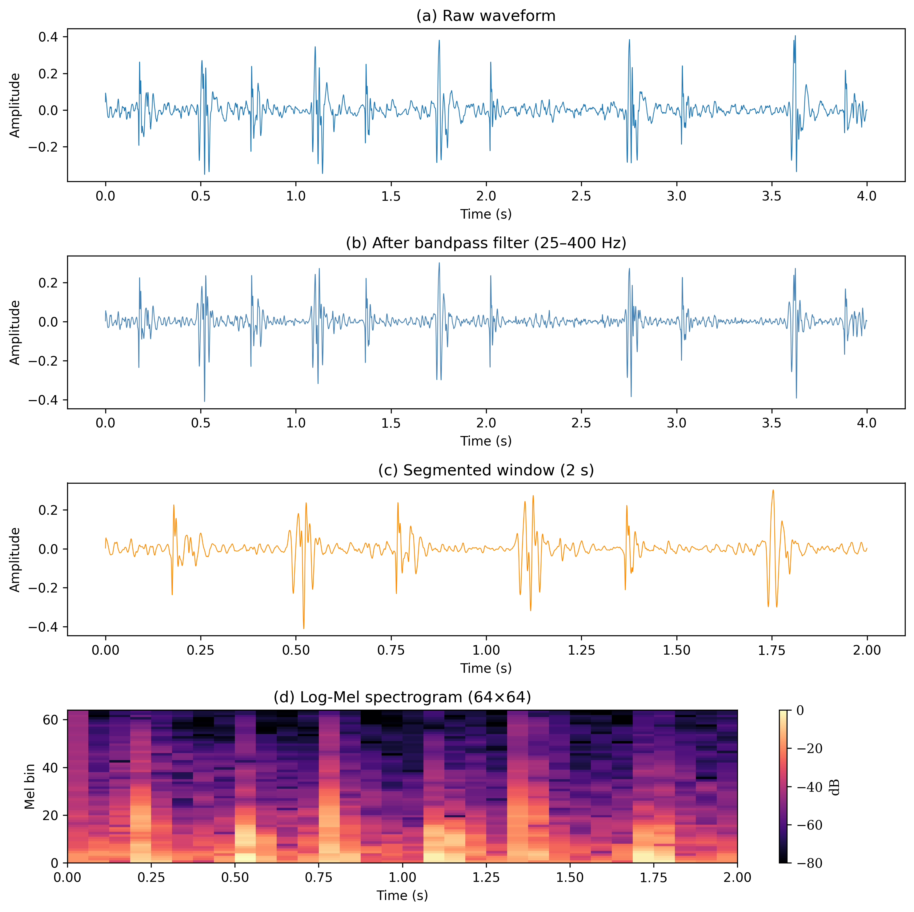
**Figure 3.1: Signal preprocessing pipeline: (a) raw waveform; (b) bandpass filtered; (c) 2-second segment; (d) Log-Mel spectrogram.**

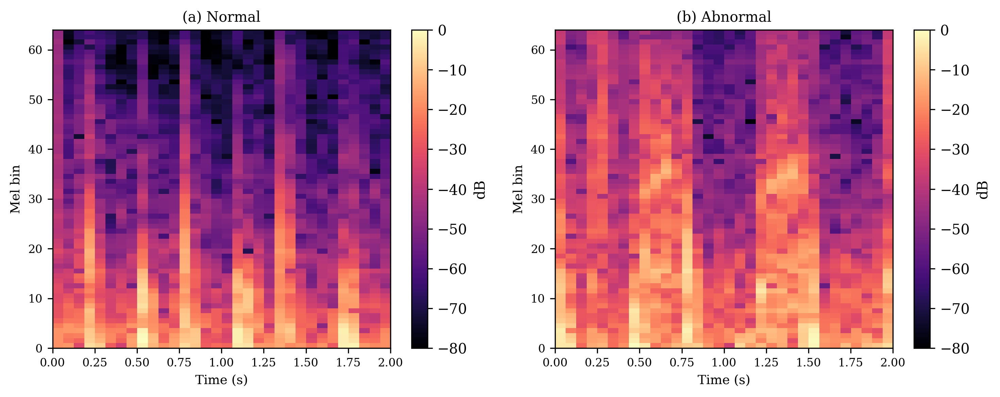
**Figure 3.2: Log-Mel spectrograms for a Normal (left) and Abnormal (right) recording after full preprocessing.**


### 3.3 Data Augmentation and Class Balancing

**Class balancing.** `WeightedRandomSampler` is applied at the DataLoader level for both datasets, assigning each sample a weight inversely proportional to its class frequency. This produces balanced mini-batches without modifying the underlying data distribution, directly counteracting the 4:1 and 8:1 imbalances.

**Waveform augmentation.** Five stochastic augmentations are applied in sequence to each training segment at load time; validation and test splits receive no augmentation. All operations act on the raw waveform prior to Mel spectrogram extraction.

| Operation | Description | Probability |
|-----------|-------------|:-----------:|
| Random gain | Amplitude scaling ∈ [0.8, 1.2] | 0.5 |
| Gaussian noise | Additive white noise, SNR ∈ [20, 35] dB | 0.5 |
| Time shift | Circular shift by up to ±10% of segment length | 0.5 |
| Random resampling | Time-stretch by factor ∈ [0.9, 1.1], re-padded to original length | 0.3 |
| Polarity inversion | Multiply waveform by −1 | 0.5 |

Together these operations simulate variability in probe placement, ambient noise, and heart rate fluctuations encountered in uncontrolled home environments.

---

## Chapter 4: Model Design

### 4.1 Overall Architecture

The system deploys two independent model instances in a cascaded inference pipeline: a Signal Quality Assessment (SQA) model and a diagnostic model. Both share the same network architecture but are trained on separate datasets for distinct binary classification tasks.

The SQA model serves as a gating function. Before any cardiac recording reaches the diagnostic stage, the SQA model evaluates each 2-second segment for acoustic usability. Segments contaminated by motion artefacts, ambient noise, or insufficient probe contact are rejected; only segments classified as high-quality are forwarded for diagnosis. The final diagnostic decision is produced by aggregating predictions across all accepted segments via weighted averaging, reducing sensitivity to any single noisy window.

This decoupled design has two practical advantages. First, it prevents corrupted input from directly biasing the diagnostic output—a critical concern for a device used in uncontrolled home environments. Second, training the two models independently allows each to be optimised for its own class distribution and evaluation criterion, rather than forcing a single model to solve both problems jointly.

Both models accept a log-Mel spectrogram of shape 1×64×64 as input: one channel, 64 Mel frequency bins spanning 25–400 Hz, and 64 time frames corresponding to a 2-second segment at 2 kHz sampling rate with 128-sample hop length. The compact representation keeps inference memory within the constraints of the Raspberry Pi 4B while retaining the frequency-temporal structure that distinguishes normal S1/S2 patterns from pathological sounds.

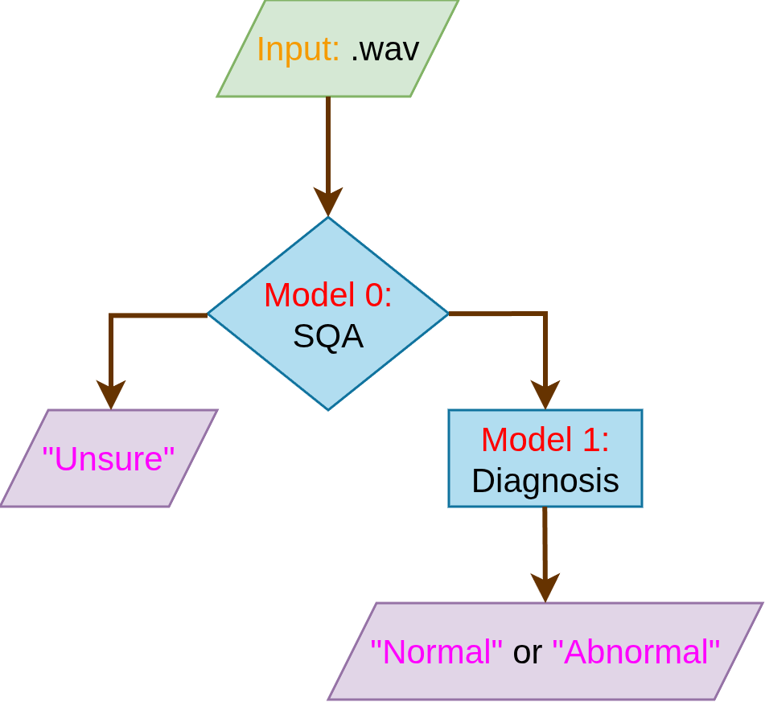
**Figure 4.1: Cascaded dual-model inference pipeline.**

### 4.2 Lightweight CNN Backbone

The backbone is a four-stage convolutional network built around the depthwise separable convolution (DSC) primitive [18]. A DSC block factorises a standard k×k convolution into two sequential operations: a depthwise convolution that filters each input channel independently with a k×k kernel, followed by a pointwise (1×1) convolution that mixes channels. For $C_\text{in}$ input channels, $C_\text{out}$ output channels, and kernel size $k$, this reduces the parameter count from $C_\text{in} \times C_\text{out} \times k^2$ to $C_\text{in} \times k^2 + C_\text{in} \times C_\text{out}$—a factor of approximately $k^2 = 9$ for 3×3 kernels. This makes DSC well-suited to edge deployment where model size directly determines both storage footprint and inference latency.


**Figure 4.2: Standard convolution vs depthwise separable convolution. Reproduced from [27].**

The network begins with a single standard 3×3 convolutional layer that projects the single-channel input to 32 feature maps. This initial layer uses a full convolution because the input has only one channel, making the depthwise factorisation trivial. Three subsequent DSC stages progressively double the channel count while halving the spatial resolution via 2×2 max-pooling. A global average pooling layer collapses the spatial dimensions to a 256-dimensional vector, which passes through a dropout layer (rate 0.3) and a linear classifier.

**Table 4.1: LightweightCNN layer specifications.**

| Stage | Operation | Channels (in→out) | Spatial (H×W) |
|---|---|---|---|
| conv1 | Conv2d 3×3, BN, ReLU | 1 → 32 | 64 × 64 |
| layer2 | DSC 3×3 + CoordAtt, MaxPool2d | 32 → 64 | 32 × 32 |
| layer3 | DSC 3×3 + CoordAtt, MaxPool2d | 64 → 128 | 16 × 16 |
| layer4 | DSC 3×3 + CoordAtt, MaxPool2d | 128 → 256 | 8 × 8 |
| global\_pool | AdaptiveAvgPool2d(1,1) | 256 | 1 × 1 |
| classifier | Dropout(0.3), Linear | 256 → 2 | — |

The total trainable parameter count is approximately 65.12K. The quantized INT8 TFLite model occupies 144.7 KB on disk.

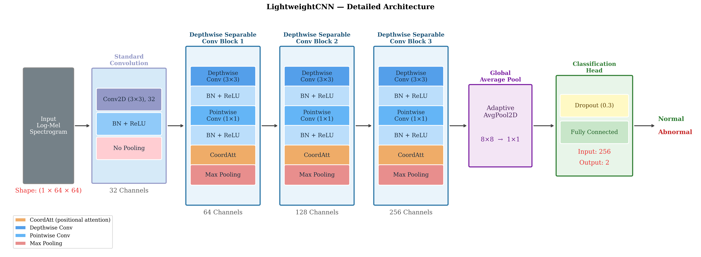
**Figure 4.3: LightweightCNN architecture.**

The depth of three DSC stages is determined jointly by the input resolution and the edge deployment constraint. Each stage halves the spatial dimension via 2×2 max-pooling, producing the progression 64×64 → 32×32 → 16×16 → 8×8 before global average pooling. A shallower network of two stages would leave the feature map at 16×16, collapsing spatial detail too early for the subsequent attention module to localise meaningful time-frequency patterns. A fourth stage would reduce the map to 4×4 and require doubling the final channel count to 512, adding approximately 525K parameters—an unjustifiable cost for a binary classification task on a resource-constrained device. The channel schedule (32→64→128→256) follows the standard practice of doubling capacity as spatial resolution halves, preserving information through progressive compression [18]. Global average pooling replaces a large fully connected bottleneck: reducing each channel to a scalar before the linear classifier eliminates the dense weight matrix that would otherwise dominate the parameter count and introduce strong overfitting pressure on the limited training set. A single dropout layer (rate 0.3) before the final linear layer provides additional regularisation. The contribution of each component is empirically validated in Section 5.2.1.

### 4.3 Coordinate Attention Module

Each DSC block in layers 2–4 integrates a Coordinate Attention (CoordAtt) module [28] inserted after the pointwise convolution.

The design choice is motivated by a limitation of the Squeeze-and-Excitation (SE) block [21], the most widely adopted channel attention mechanism. SE computes a global descriptor by average-pooling the entire spatial feature map into a single C-dimensional vector, then uses it to rescale channel responses. This operation is spatially blind: it encodes which channels matter globally but discards where within the feature map the relevant activations occur. For heart sound spectrograms, spatial position carries diagnostic information. S1 and S2 energy concentrates in specific frequency bands (predominantly below 200 Hz) and at characteristic temporal positions within the cardiac cycle; pathological murmurs occupy frequency ranges that differ from normal sounds. An attention mechanism that ignores spatial structure cannot selectively amplify these localised cues.

![[Comparison to Squeeze-and-Excitation block abd CBAM.png]]
**Figure 4.4: Comparison of SE, CBAM, and CoordAtt attention mechanisms. Reproduced from Hou et al. [28].**


CoordAtt retains positional information by decomposing spatial pooling along the two axes independently. Given a feature map $\mathbf{X} \in \mathbb{R}^{N \times C \times H \times W}$, the module proceeds as follows:

1. **Directional pooling.** $\mathbf{X}$ is pooled along the width axis to produce $\mathbf{X}_h \in \mathbb{R}^{N \times C \times H \times 1}$ (encoding frequency-axis context) and along the height axis to produce $\mathbf{X}_w \in \mathbb{R}^{N \times C \times 1 \times W}$ (encoding time-axis context). Unlike global average pooling, each element retains its position along the non-pooled axis.

2. **Joint encoding.** $\mathbf{X}_h$ and $\mathbf{X}_w$ (transposed to align the spatial dimension) are concatenated along the height axis and passed through a shared 1×1 convolution followed by BatchNorm and ReLU. The intermediate channel dimension is $m = \max(8, \lfloor C/16 \rfloor)$, giving $m = 8, 8, 16$ for $C = 64, 128, 256$ at layers 2, 3, 4 respectively.

3. **Attention map generation.** The encoded tensor is split back into height- and width-specific components. Each is projected by a separate 1×1 convolution and sigmoid to produce $\mathbf{a}_h \in [0,1]^{N \times C \times H \times 1}$ and $\mathbf{a}_w \in [0,1]^{N \times C \times 1 \times W}$.

4. **Recalibration.** The output is $\mathbf{X} \cdot \mathbf{a}_h \cdot \mathbf{a}_w$. Because $\mathbf{a}_h$ varies along the frequency axis and $\mathbf{a}_w$ varies along the time axis, their elementwise product creates a 2D attention map that weights each spatial location according to both frequency and temporal position—without collapsing either axis.

![[Coordinate-Attention.png]]
**Figure 4.5: Coordinate Attention structure. Reproduced from Cao et al. [29].**

![[Paper_Photo/How to plug the proposed CA block in the inverted residual block abd the sunglass block.png]]

**Figure 4.6: CoordAtt integration into DSC blocks. Reproduced from Hou et al. [28].**

The additional parameter cost per CoordAtt block is small: approximately 1.6K, 3.1K, and 12.3K at layers 2, 3, and 4 respectively, modest relative to the DSC blocks they augment. The contribution of each component is empirically validated in Section 5.2.1.

### 4.4 Signal Quality Assessment Model

A joint multi-task formulation with a shared backbone and two classification heads was considered but rejected on the grounds of feature conflict. Acoustic artefacts in low-quality recordings—broadband noise, contact friction, and motion transients—produce spectrogram patterns that partially overlap with pathological murmurs in the mid-frequency range. Under joint training, the SQA and diagnostic objectives would impose conflicting gradient signals on the shared representation for this overlapping pattern class, likely degrading both tasks. Training the two models independently allows each to develop a representation optimised for its own label space without interference.

The SQA model therefore shares the same LightweightCNN + CoordAtt architecture as the diagnostic model—identical backbone, attention integration, and classifier head—and is trained independently on the quality-labelled dataset described in Section 3.1. The architecture reuse is not merely an engineering convenience: SQA faces the same underlying feature-extraction problem as diagnosis. Distinguishing a bad-quality recording from a good one requires detecting temporal and spectral irregularities—abrupt noise bursts, contact transients, aperiodic broadband energy—patterns whose presence or absence must be localised across both the frequency axis and the time axis of the spectrogram. This is precisely the task that the LightweightCNN + CoordAtt combination is designed for: the depthwise separable backbone extracts hierarchical spectro-temporal features efficiently, and the Coordinate Attention module provides the spatial specificity needed to locate artefact-like patterns within the feature map. A simpler classifier—for example, a shallow CNN without attention or a feature-engineered model—would lack the representational capacity to distinguish high-frequency transient noise from S1/S2 impulses, or low-frequency contact rumble from murmur energy, without explicit hand-crafted features. At inference time, the SQA model produces a Good-Quality probability P(Good) ∈ [0, 1] per segment; this value is used directly as a continuous weight in the diagnostic aggregation step rather than as a binary gate, so borderline-quality segments down-weight the final result rather than being discarded entirely.

### 4.5 Model Quantization

Both models are converted to TFLite format using the `ai_edge_torch` library, which compiles a PyTorch model directly to a TFLite flatbuffer without an intermediate ONNX step. Two variants are produced per model: an FP32 baseline and a quantized version using dynamic range quantization (`tf.lite.Optimize.DEFAULT`).

Dynamic range quantization statically converts all weight tensors from FP32 to INT8 at export time, reducing the weight storage footprint by approximately 4×. Activations are not statically quantized; instead, their ranges are computed dynamically per inference call. This approach requires no calibration dataset, making it straightforward to apply to any trained checkpoint. The trade-off relative to full integer quantization—where both weights and activations are fixed at INT8—is that activation quantization overhead occurs at runtime rather than being amortized.

The resulting quantized models each occupy 144.7 KB on disk. On the ARM Cortex-A72 of the Raspberry Pi 4B, weight-compressed INT8 models reduce memory bandwidth pressure during inference. Quantitative accuracy retention and latency comparisons between the FP32 and quantized variants are reported in Chapter 5.

---

## Chapter 5: Training and Experiments

This chapter reports all training experiments conducted during model development. Section 5.1 describes the shared training configuration and evaluation metrics used across all experiments. Sections 5.2 and 5.3 present the diagnostic and SQA model results respectively, each covering training progression, hyperparameter search, and decision threshold analysis. Section 5.4 reports the ablation study, which isolates the contribution of each architectural component. Section 5.5 evaluates the impact of post-training quantization on model size and accuracy.

### 5.1 Training Configuration

All experiments use the same 80/10/10 recording-level split (seed = 42), with the test set filenames persisted to disk on the first run and held fixed throughout. Slices from the same recording never appear across splits, preventing any form of data leakage. WeightedRandomSampler is applied on the training set in all runs to counteract the 4:1 class imbalance.

The model is trained with Adam optimiser, learning rate 1×10⁻³, and a `ReduceLROnPlateau` scheduler (factor = 0.5, patience = 3, monitored on validation M-Score). Early stopping with patience = 10 is applied in all runs except Run 1. The model checkpoint with the highest validation M-Score is saved and used for test evaluation.

**Evaluation metrics.** The PhysioNet/CinC 2016 challenge defines the primary metric as:

$$M\text{-}Score = \frac{Se + Sp}{2}$$

where Sensitivity $Se = \frac{TP}{TP + FN}$ measures the fraction of abnormal recordings correctly identified, and Specificity $Sp = \frac{TN}{TN + FP}$ measures the fraction of normal recordings correctly identified. M-Score is preferred over accuracy because accuracy can reach 80% by predicting all recordings as Normal, while yielding $Se = 0$ and $\text{M-Score} = 0.5$. All models are saved and compared by M-Score.

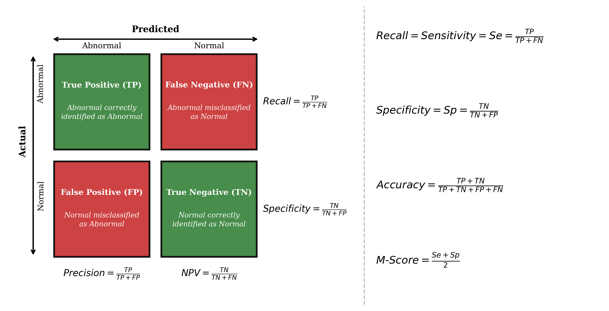
**Figure 5.1: Confusion matrix structure and derived metrics (Se, Sp, M-Score).**

### 5.2 Diagnostic Model Results

#### 5.2.1 Ablation Study

To quantify the contribution of each architectural component, four model variants were trained under identical conditions: the same dataset split, preprocessing parameters ($n_\text{mels}$ = 32, hop length = 96, $n_\text{fft}$ = 256, overlap = 0.5), training hyperparameters (batch = 16, lr = 1×10⁻³, weight decay = 1×10⁻⁴, early stopping patience = 10), and class balancing strategy. The variants form a cumulative chain, each adding one modification to the previous.

**Table 5.1: Ablation study results.**

| Config | Params | Test M-Score | Test Se | Test Sp | Test Acc | Best Epoch |
|--------|-------:|:------------:|:-------:|:-------:|:--------:|:----------:|
| A: Baseline (16→32→64→128, no attention) | 12.87K | 0.8851 | 0.9654 | 0.8049 | 0.8352 | 1 |
| B: + Wider channels (32→64→128→256) | 47.23K | 0.8896 | 0.9595 | 0.8198 | 0.8462 | 1 |
| C: + CoordAtt + Dropout(0.3) | 65.12K | 0.8869 | 0.9383 | 0.8355 | 0.8549 | 5 |
| D: + Residual connections | 108.10K | **0.8912** | **0.9797** | 0.8027 | 0.8361 | 2 |

**A → B: Wider channels.** Doubling the channel width throughout (+0.005 M-Score) improves both Se and Sp marginally. The best epoch remains 1, indicating that the model still overfits rapidly and that increased capacity alone does not improve training dynamics.

**B → C: CoordAtt + Dropout.** Adding Coordinate Attention and Dropout (rate 0.3) produces the most notable change in training behaviour: the best validation epoch shifts from 1 to 5, indicating substantially better regularisation. M-Score decreases slightly (−0.003) relative to B, but Sp increases by +0.016 and the Se/Sp gap narrows from 0.134 to 0.103. The contribution of CoordAtt is therefore more accurately characterised as improved training stability and better Se/Sp balance than raw M-Score gain.

**C → D: Residual connections.** Residual connections yield the highest test M-Score (0.8912, +0.004 over C), driven by a large Se increase (+0.041). However, Sp drops to 0.8027—lower than any other variant—and the best epoch regresses to 2, suggesting that residual connections accelerate convergence at the cost of reinforcing the model's tendency to over-predict Abnormal. The Se/Sp gap widens to 0.177.

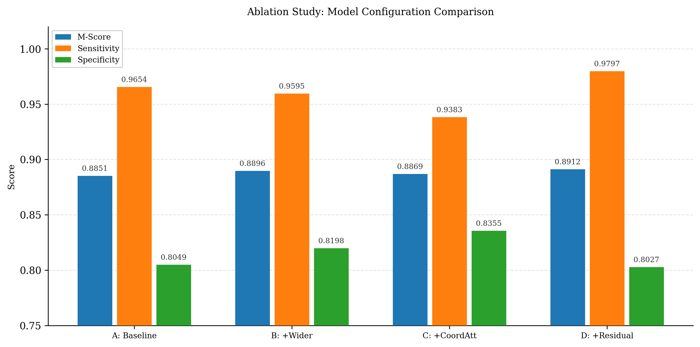
**Figure 5.2: Ablation study — M-Score, Se, and Sp across four model configurations.**

**Architecture selection.** Config C is selected as the final architecture. While D achieves the highest M-Score, its Se/Sp imbalance (0.177 gap) is worse than A (0.161) and substantially worse than C (0.103). In a home screening device where missed abnormal cases carry greater clinical risk than false alarms, Se is more important than Sp—but the magnitude of Sp degradation in D (0.8027, a 32.8% false alarm rate on normal recordings) is considered unacceptable for a practical device. Config C provides the best balance across all three criteria: Se/Sp balance, training stability, and parameter efficiency.

#### 5.2.2 Hyperparameter Search

A Bayesian sweep over 40 trials was conducted using Weights & Biases, optimising for validation M-Score. The search space covered n\_mels ∈ {32, 64}, hop\_length ∈ {64, 96, 128}, n\_fft ∈ {128, 256, 512}, overlap ∈ {0.25, 0.5, 0.75}, learning rate ∈ {3×10⁻⁴, 5×10⁻⁴, 1×10⁻³}, and weight\_decay ∈ {1×10⁻⁴, 1×10⁻³}.

**Table 5.2: Top 3 sweep trials (validation M-Score).**

| Rank | Val M-Score | Val Se | Val Sp | n\_mels | hop | n\_fft | overlap | lr | weight\_decay |
|------|:-----------:|:------:|:------:|:-------:|:---:|:------:|:-------:|:--:|:-------------:|
| 1 | 0.9033 | 0.9510 | 0.8556 | 64 | 128 | 256 | 0.75 | 1e-3 | 1e-3 |
| 2 | 0.9031 | 0.9677 | 0.8386 | 64 | 96 | 256 | 0.75 | 1e-3 | 1e-3 |
| 3 | 0.9000 | 0.9539 | 0.8462 | 64 | 128 | 256 | 0.75 | 1e-3 | 1e-3 |

The configuration $n_\text{mels}$ = 64, $n_\text{fft}$ = 256, overlap = 0.75, lr = 1×10⁻³ appears consistently across the top trials, indicating a stable optimal region. The selected parameters for the final model are $n_\text{mels}$ = 64, hop length = 128, $n_\text{fft}$ = 256, weight decay = 1×10⁻³.

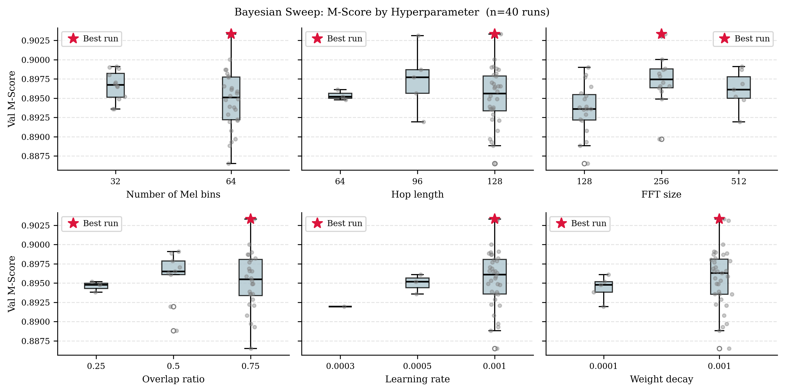
**Figure 5.3: Validation M-Score for the top-performing sweep configurations.**

#### 5.2.3 Training Progression

Seven training runs were conducted to assess the impact of training decisions and to validate the preprocessing parameters identified by the hyperparameter sweep (Section 5.2.2). All runs use the LightweightCNN + CoordAtt architecture (Config C from Section 5.2.1). Table 5.3 summarises the key configurations and test results.

**Table 5.3: Training run comparison.**

| Run | Batch | n\_mels | hop | Label Smooth | Early Stop | Test M-Score | Test Se | Test Sp |
|-----|-------|---------|-----|:---:|:---:|:---:|:---:|:---:|
| 1 | 16 | 32 | 96 | ✗ | ✗ | 0.8852 | 0.9569 | 0.8135 |
| 2 | 16 | 32 | 96 | ✓ | ✓ | 0.8816 | 0.9181 | 0.8452 |
| 3 | 16 | 32 | 96 | ✓ | ✓ | 0.8828 | 0.9105 | 0.8551 |
| 4 | 256 | 32 | 96 | ✗ | ✓ | 0.8835 | 0.9544 | 0.8125 |
| 5 | 256 | 64 | 128 | ✗ | ✓ | 0.8784 | 0.9409 | 0.8159 |
| 6 (sweep params) | 16 | 64 | 128 | ✗ | ✓ | **0.8903** | **0.9485** | **0.8322** |
| 7 | 16 | 32 | 96 | ✗ | ✓ | 0.8869 | 0.9383 | 0.8355 |

> *Run 3 uses overlap = 0.75 (vs 0.5 in others), held constant as a separate variable.*

Several consistent patterns emerge across runs. First, label smoothing (Run 2 vs Run 4) shifts the Se/Sp balance toward higher Sp at the cost of Se—the Se/Sp gap narrows from 0.143 to 0.073—but produces no meaningful change in M-Score (0.8816 vs 0.8835). Since the home screening use case penalises missed abnormal cases more heavily than false alarms, label smoothing was excluded from subsequent runs. Second, batch size 16 consistently outperforms batch size 256 when holding all other parameters fixed (Run 6 vs Run 5: +0.012 M-Score; Run 7 vs Run 4: +0.003), likely because smaller batches provide noisier but more frequent gradient updates that regularise training. Third, overlap = 0.75 (Run 3) produces no meaningful improvement over overlap = 0.5 at the same configuration.

**Run 6** achieves the highest test M-Score (0.8903) and is selected as the final model. It combines the sweep-identified preprocessing parameters (Section 5.2.2) with the empirically optimal batch size of 16.

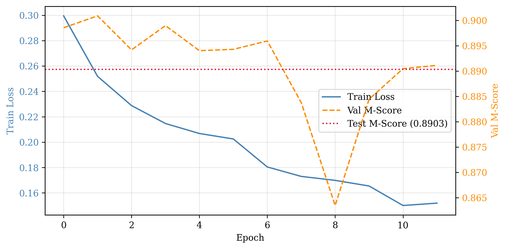
**Figure 5.4: Training curve: diagnostic model (Run 6).**

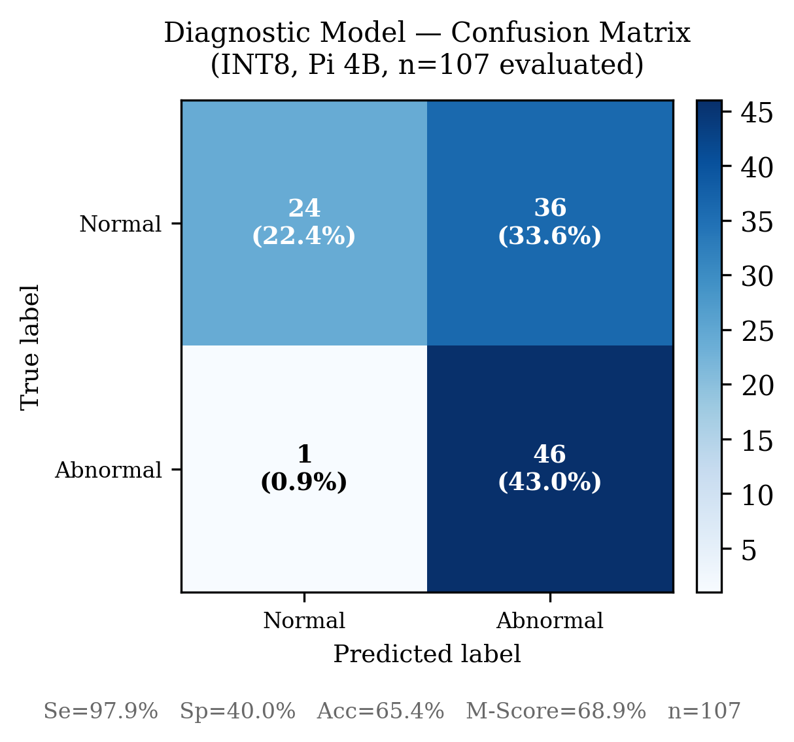
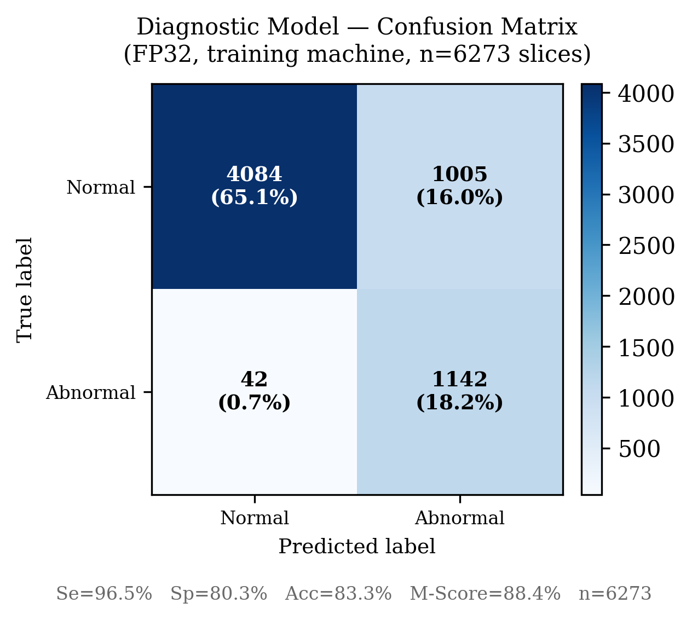
**Figure 5.5: Confusion matrix for the final diagnostic model (Run 6) on the test set. Left: evaluated on Pi (INT8); Right: evaluated on training machine (FP32).**

#### 5.2.4 Decision Threshold Analysis

The default classification threshold of 0.5 was evaluated against a sweep from 0.30 to 0.80 on the final model (Run 6). Results are shown in Fig. 5.6.

The sweep confirms that 0.50 is both the optimal and the default threshold: it achieves the highest M-Score (0.8835) while maintaining the highest Se (0.9645). M-Score is relatively flat in the conservative range 0.30–0.50 (0.8792–0.8835), indicating robustness to lower thresholds, but falls sharply above 0.55 as Sp gains are outweighed by Se losses. The Se/Sp imbalance across the full sweep reflects the model's learned decision boundary rather than a post-processing artefact—no threshold adjustment can recover the asymmetry without sacrificing M-Score. The default threshold of 0.50 is retained for deployment.

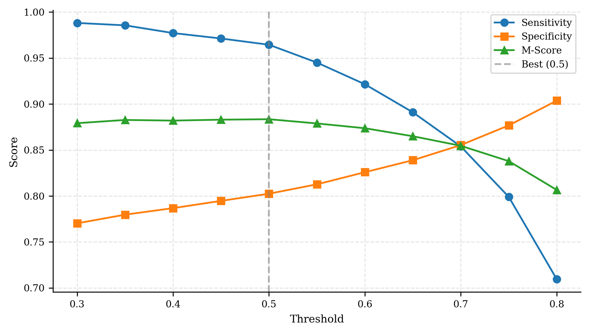
**Figure 5.6: Classification threshold analysis: diagnostic model (Run 6).**

### 5.3 SQA Model Results

The SQA model shares the same LightweightCNN + CoordAtt architecture (65.12K parameters) and training hyperparameters as the final diagnostic model (batch = 16, early stopping patience = 10). The dataset is `metadata_quality_reversed.csv` (3,240 recordings, Bad:Good = 364:2,876), split 80/10/10 by recording, yielding 54,842 training, 6,536 validation, and 6,726 test segments. Preprocessing uses the final configuration (n\_mels = 64, hop = 128). Three training runs were conducted to progressively address the Se deficit caused by the more severe 8:1 class imbalance.

**Table 5.4: SQA model — validation M-Score across training epochs (Run 1 baseline).**

| Epoch | Val Se (Bad) | Val Sp (Good) | Val M-Score |
|:-----:|:------------:|:-------------:|:-----------:|
| 1 | 0.7409 | 0.8592 | 0.8000 |
| 3 | 0.7263 | 0.8826 | 0.8044 |
| 9 | 0.7172 | 0.9036 | 0.8104 |
| **12** | **0.7281** | **0.9050** | **0.8165** ← best |
| 22 | 0.6825 | 0.9377 | 0.8101 (early stop) |

**Run 1** (lr = 1×10⁻³, CrossEntropyLoss, dropout = 0.3) establishes the baseline. Validation M-Score oscillates noticeably across epochs (0.78–0.82), a sign of unstable training under the 8:1 imbalance. Test Se = 0.7173: 28.3% of bad-quality segments pass through to the diagnostic model undetected.

**Run 2** adds an explicit class weight of [1, 8] to the loss function and reduces the learning rate to 5×10⁻⁴ (scheduler patience raised from 3 to 5). The loss weighting directly penalises missed Bad-class predictions more heavily. Val oscillation narrows (0.80–0.83), and test Se improves to 0.7651 (+0.048). Sp drops to 0.8554 as expected from the stronger minority-class bias.

**Run 3** increases dropout from 0.3 to 0.5, retaining all other Run 2 changes. The heavier regularisation reduces overfitting on the small Bad-class population: test Se reaches 0.8274 (+0.062 over Run 2), and the train/val loss gap narrows. The best validation checkpoint now appears at Epoch 2—earlier convergence than Run 2—after which M-Score declines monotonically to early-stop at Epoch 12. Run 3 is selected as the final SQA model.

**Table 5.5: SQA model — three-run progression.**

| Metric | Run 1 | Run 2 | **Run 3 (final)** | Run 1→3 change |
|--------|:-----:|:-----:|:-----------------:|:--------------:|
| Test M-Score | 0.8046 | 0.8102 | **0.8152** | +0.011 |
| Test Se (Bad) | 0.7173 | 0.7651 | **0.8274** | +0.110 |
| Test Sp (Good) | 0.8919 | 0.8554 | 0.8029 | −0.089 |
| Test Accuracy | 0.8794 | 0.8489 | 0.8046 | — |
| Best Val Se | 0.7281 | 0.8120 | 0.8759 | +0.148 |
| Val→Test Se gap | −0.011 | −0.047 | −0.048 | stable ~0.05 |
| Early stop epoch | 22 | 22 | 12 | faster |

**Table 5.6: Final SQA model (Run 3) vs diagnostic model.**

| Metric | Diagnostic Model (Run 6) | SQA Model (Run 3) |
|--------|:------------------------:|:-----------------:|
| Test M-Score | 0.8903 | 0.8152 |
| Test Se | 0.9485 | 0.8274 |
| Test Sp | 0.8322 | 0.8029 |
| Test Accuracy | 0.8541 | 0.8046 |
| Class imbalance | 4:1 | 8:1 |

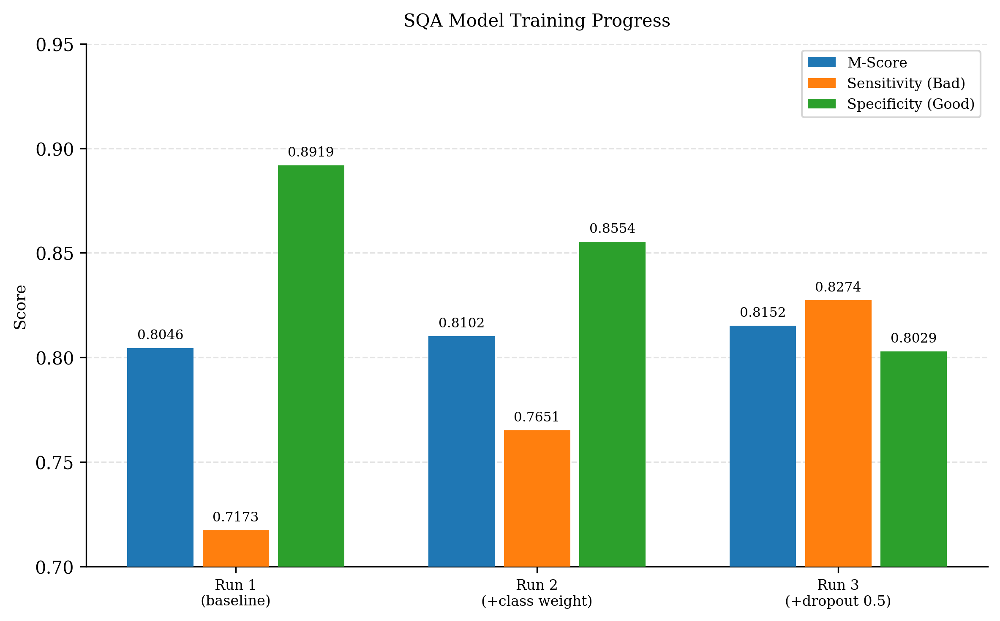
**Figure 5.7: SQA model M-Score, Se, and Sp across three training runs.**

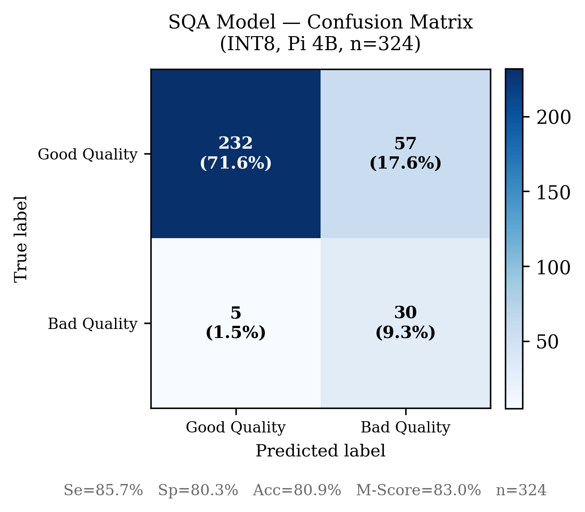
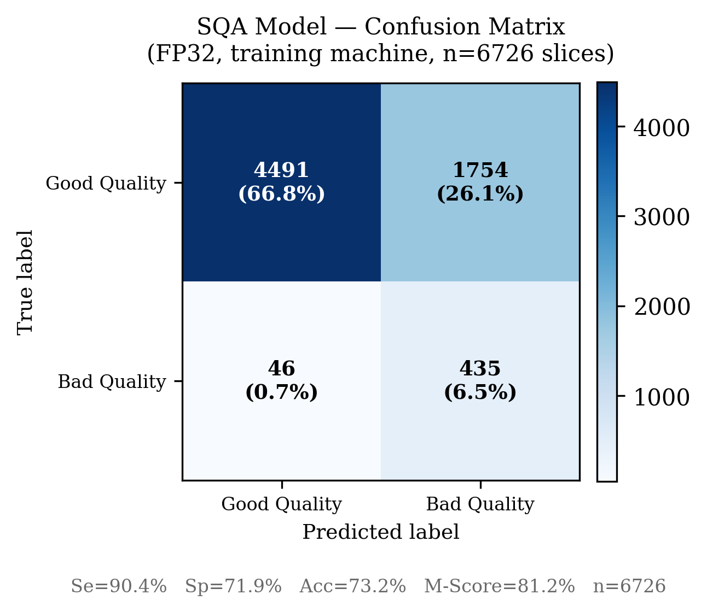
**Figure 5.8: Confusion matrix for the final SQA model (Run 3) on the test set. Left: evaluated on Pi (INT8); Right: evaluated on training machine (FP32).**

The persistent Val→Test Se gap of approximately 0.048 across Runs 2 and 3 indicates that the generalisation ceiling is constrained by the small Bad-class population (364 recordings total; roughly 36 recordings in the test split), rather than by the training configuration. Further Se improvement would require additional bad-quality data. The Sp of 0.8029 means approximately 20% of good-quality recordings receive a lower P(Good) weight in the inference aggregation; this reduces effective signal volume but does not introduce noise into the diagnostic stage, and is considered acceptable given the deployment context.

#### 5.3.1 Decision Threshold Analysis

The classification threshold of the SQA model determines the minimum P(Good) required for a segment to be accepted by the inference pipeline. A sweep from 0.30 to 0.80 was conducted on the final SQA model (Run 3). Results are shown in Fig. 5.9.

The M-Score curve is notably flat throughout the sweep range (0.8064–0.8143), indicating that the model's discrimination is not strongly threshold-dependent. A threshold of 0.65 is selected as it achieves the highest M-Score while providing a better Se/Sp balance than lower thresholds. Relative to the default 0.50, raising the threshold to 0.65 reduces Se by 0.031 (from 0.9044 to 0.8732) while improving Sp by 0.036 (from 0.7191 to 0.7553). The higher threshold is preferred for the inference gate because it reduces false rejections of genuinely good-quality segments—at threshold 0.50, approximately 28% of good-quality segments would be down-weighted unnecessarily—at a modest and acceptable cost in bad-segment detection.

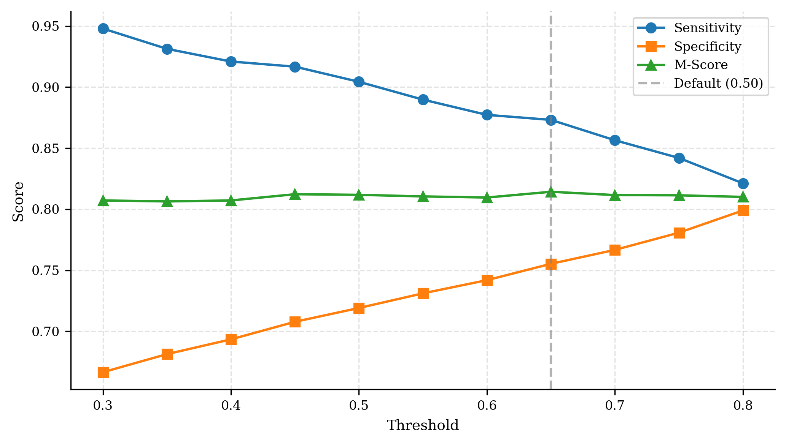
**Figure 5.9: Classification threshold analysis: SQA model (Run 3).**

### 5.4 Quantization Impact

Post-training quantization is applied to both models via dynamic range quantization (`tf.lite.Optimize.DEFAULT`), which statically converts all weight tensors from FP32 to INT8 at export time while leaving activations in floating point. Table 5.7 summarises the impact on model size and diagnostic accuracy.

**Table 5.7: FP32 vs INT8 quantization comparison.**

| Metric | FP32 | INT8 (Dynamic Range) | Change |
|--------|:----:|:--------------------:|:------:|
| Model size | 302.8 KB | 144.7 KB | −52.2% |
| Test M-Score | 87.1% | 87.0% | −0.1% |
| Test Se | 91.7% | 91.7% | 0.0% |
| Test Sp | 82.4% | 82.3% | −0.1% |
| Test Accuracy | 84.2% | 84.1% | −0.1% |

All accuracy metrics change by at most 0.1 percentage point, within the expected rounding variation of per-slice evaluation. The storage footprint halves; diagnostic performance is unaffected.

Latency impact is equally marginal and is detailed in Table 6.1 (Section 6.3). Because dynamic range quantization leaves activations at float32 at runtime, the ARM Cortex-A72 cannot execute true INT8 GEMM operations; the benefit is reduced memory bandwidth for weight loading only. Full integer quantization—where both weights and activations are fixed at INT8—would be needed to realise arithmetic-level speedup.

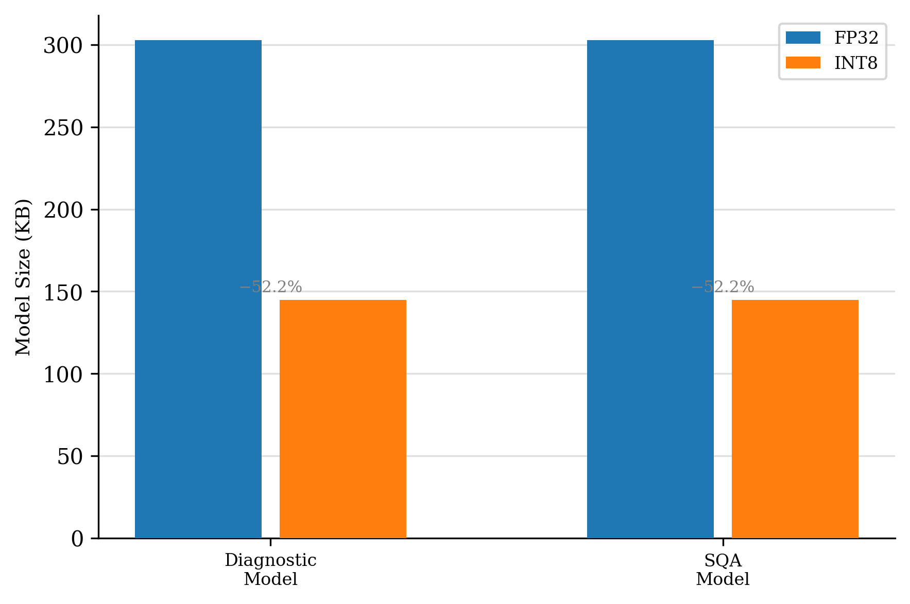
**Figure 5.10: FP32 vs INT8 model size: diagnostic and SQA models.**

---

## Chapter 6: Edge Deployment

### 6.1 System Architecture Overview

The deployed system consists of two physical units: an ESP32-based acquisition device and a Raspberry Pi 4B inference station, communicating exclusively over Bluetooth Low Energy (BLE). The separation of concerns between the two units is deliberate: the ESP32 handles only signal capture and wireless transmission, keeping its firmware simple and power-efficient, while all computation-intensive processing—filtering, feature extraction, and model inference—runs on the Pi.

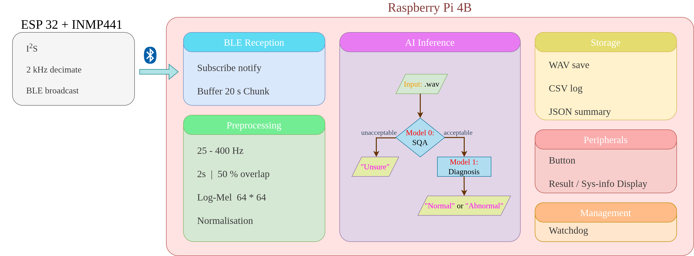
**Figure 6.1: System architecture overview.**

**ESP32 (acquisition side).** The ESP32 captures audio via I²S, decimates to 2,000 Hz, applies a 30× digital gain, and streams 16-bit PCM samples to the Pi over BLE as 128-byte GATT notifications. Hardware design and firmware are described in the companion thesis.

**Raspberry Pi 4B (inference side).** The Pi runs a single asyncio event loop (`main_pi.py`) that manages BLE reception, preprocessing, inference, storage, and UI updates concurrently without multi-threading. A `bleak` BLE client subscribes to ESP32 notifications; received bytes accumulate in a bytearray ring buffer. Once 80,000 bytes (40,000 samples = 20 seconds of audio) have arrived, the chunk is placed onto an asyncio queue and handed off to a dedicated inference worker task. Within each 20-second chunk, a sliding window of 2 seconds with 50% overlap (`HOP_SAMPLES = 2,000`) produces 19 overlapping windows; each window is independently preprocessed and scored. The chunk-level label is derived from a quality-weighted average over all windows that pass the SQA check (described in Section 6.2). A background asyncio task refreshes the system-status display every 2 seconds independently of the inference cycle.

### 6.2 Real-Time Inference Pipeline

**Preprocessing on-device.** The 20-second chunk (40,000 int16 samples) is converted to float32 by dividing by 32,768, then passed through a 5th-order Butterworth bandpass filter (25–400 Hz, zero-phase) in one pass. Each 2-second sliding window (4,000 samples) is then extracted and peak-normalised independently: the window is divided by its maximum absolute value, preventing any single noise spike from suppressing the entire chunk. Log-Mel spectrogram extraction is applied per window ($n_\text{mels}$ = 64, $n_\text{fft}$ = 256, hop length = 128, $f_\text{min}$ = 25 Hz, $f_\text{max}$ = 400 Hz, power = 2.0). The time axis is zero-padded or trimmed to a fixed length of 64 frames, yielding a 64 × 64 feature map. This is reshaped to tensor shape (1, 1, 64, 64) for TFLite input.

**Cascaded TFLite inference.** Each window is independently processed by two INT8 quantized TFLite models loaded at startup. The SQA model runs first, producing a Good-Quality probability P(Good) ∈ [0, 1]. Windows with P(Good) < 0.65 are rejected as acoustically degraded and excluded from inference; this threshold was selected by the sweep described in Section 5.3.1. For windows that pass the SQA gate, the diagnostic model runs on the same feature tensor, producing a Normal probability P(Normal) ∈ [0, 1]. The chunk-level result aggregates all valid windows through a quality-weighted average:

$$\text{score} = \frac{\sum_{i} P(\text{Good})_i \cdot P(\text{Normal})_i}{\sum_{i} P(\text{Good})_i}$$

The final label is Normal if score > 0.5, Abnormal otherwise. Down-weighting by SQA score rather than binary rejection means that borderline-quality windows still contribute, but proportionally less than high-quality ones. If no windows in a chunk pass the SQA threshold (P(Good) < 0.6 for all 19 windows), the chunk is reported as low-quality noise and excluded from the session log.

**Data flow summary.**

```
BLE notification (128 B) → accumulate in ring buffer
→ 80,000 bytes complete (= 20 s chunk)
→ offload to inference worker via asyncio.Queue
→ int16 → float32 normalisation (÷ 32768)
→ bandpass filter (Butterworth 25–400 Hz, whole chunk)
→ sliding window (2 s, 50% overlap → 19 windows/chunk)
  └─ per-window peak normalisation (÷ max absolute value)
  └─ log-Mel spectrogram (64 × 64)
  └─ reshape to (1, 1, 64, 64)
  └─ SQA TFLite → P(Good); skip if < 0.65
  └─ Diagnostic TFLite → P(Normal)
  └─ accumulate (P(Good), P(Normal)) pairs
→ chunk result: quality-weighted average → label + confidence
→ OLED update + WAV archive
```

### 6.3 Performance Evaluation

**Table 6.1: Per-stage inference latency on Pi 4B.**

| Stage | FP32 (ms) | INT8 (ms) |
|-------|:---------:|:---------:|
| Bandpass filter | 2.24 | 2.24 |
| Log-Mel spectrogram | 4.73 | 4.73 |
| SQA model | 13.51 | 13.46 |
| Diagnostic model | 13.44 | 13.43 |
| **Total per segment** | **33.92** | **33.87** |

Preprocessing latency is identical across both configurations; the marginal TFLite speedup (under 0.1 ms per stage) reflects weight-only compression rather than arithmetic acceleration.

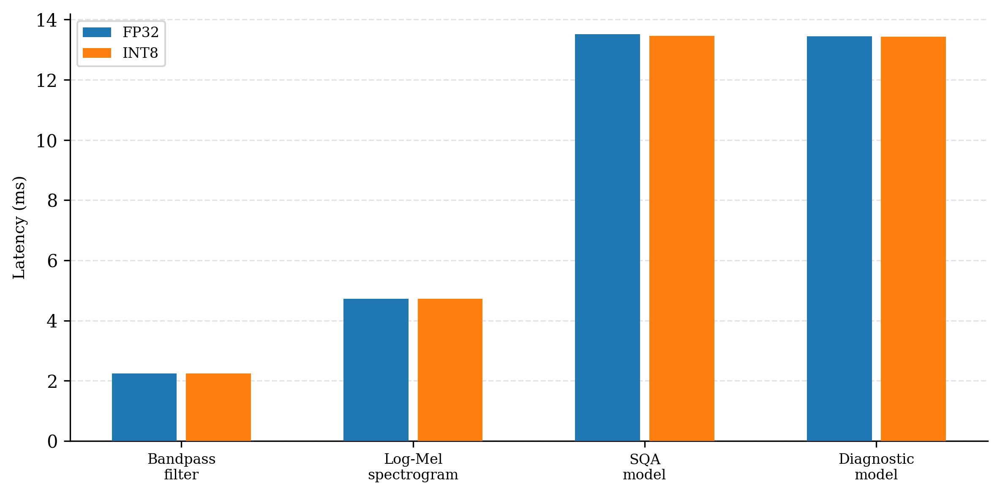
**Figure 6.2: Per-stage inference latency on Pi 4B, FP32 vs INT8.**

**Table 6.2: Resource utilisation during inference.**

| Metric | Value |
|--------|:-----:|
| Peak CPU utilisation | 1.3% |
| Memory usage (RSS) | 249.9 MB |

The 249.9 MB RSS reflects Python runtime overhead; the two TFLite model instances together contribute under 300 KB. Model file sizes for the FP32 and INT8 variants of both models are shown in Fig. 5.10.

**Realtime constraint.** The 33.9 ms total per-segment latency satisfies the 2,000 ms real-time budget with a margin of approximately 59×.

The accuracy impact of INT8 quantization on the diagnostic model is reported in Table 5.7 (Section 5.4); Sensitivity is entirely unaffected, and degradation does not exceed 0.1 percentage point across all metrics.

### 6.4 User Interface

**Physical button.** A single tactile button on GPIO27 (internal pull-up, software debounce 20 ms) provides the sole user input. The interaction model is intentionally minimal:

| Action | Effect |
|--------|--------|
| Short press (standby) | Start a diagnostic session (BLE connect → continuous chunk streaming) |
| Short press (during session) | Abort current session |
| Long press ≥ 3 s | Safe shutdown (OLED confirms → `sudo shutdown -h now`) |

**Primary OLED (128×64, SSD1306).** Connected via hardware I2C (GPIO2/3, bus 1), this display presents diagnostic-facing information across three states:

- *Standby:* Project name, team members, and supervisor; a heart icon blinks at 1 Hz. Prompts the user to press the button.
- *Connecting:* "Connecting ESP32…" with a progress bar that fills over the BLE connection timeout and a live countdown in seconds.
- *Running:* Upper half shows the current chunk number, window progress (e.g., Win: 05/09), and the running Normal probability for the active segment; lower half shows the result and confidence from the previous segment. A heart icon blinks on each valid inference window.

**Secondary OLED (128×32, SSD1306).** Connected via software I2C (GPIO23/24), this display shows CPU usage, RAM utilisation, and CPU temperature, refreshed every 2 seconds independently of the inference cycle.

### 6.5 System Reliability

Edge deployment introduces failure modes absent from server environments: intermittent BLE links, unclean power loss, and the absence of an operator to restart crashed processes. Three mechanisms address these.

**Service auto-restart (systemd).** The inference application runs as a systemd unit (`heartbeat.service`) with `Restart=on-failure`. On boot, the service starts automatically; after any unhandled exception the process is respawned without user intervention.

**Software watchdog.** The main inference loop writes a heartbeat timestamp to `/tmp/heartbeat.ts` every 30 seconds. A separate watchdog process (`watchdog.service`) restarts `heartbeat.service` if the timestamp is more than 90 seconds old, indicating the loop is frozen rather than merely idle.

**BLE error handling.** If the initial connection fails, the system displays an error and re-enters standby, prompting the user to retry. If the link drops mid-session, the inference worker detects the idle state via a 1-second queue timeout and exits cleanly on the next button press.

**Safe shutdown.** SIGTERM, SIGINT, and a 3-second button long press all trigger the same teardown sequence: stop BLE notifications → cancel asyncio tasks → flush log buffers → `sudo shutdown -h now`, avoiding SD card corruption from abrupt power cuts.

---

## Chapter 7: Conclusion

### 7.1 Summary of Contributions

This thesis designed, trained, and deployed a dual-model edge inference system for real-time heart sound diagnosis on the Raspberry Pi 4B.

A lightweight CNN integrating Coordinate Attention into depthwise separable convolution blocks achieves a Test M-Score of 0.8903 (Se = 0.9485, Sp = 0.8322) on PhysioNet/CinC 2016 with 65K parameters. Ablation experiments show that CoordAtt's primary benefit is improved Se/Sp balance and training stability rather than raw M-Score gain.

A dedicated SQA model (Test M-Score = 0.8152, Se = 0.8274) runs ahead of the diagnostic stage, assigning each incoming segment a continuous quality weight. This reduces the influence of corrupted inputs without binary gating or a hand-tuned threshold.

INT8 post-training quantization halves storage footprint (302.8 KB → 144.7 KB) with a M-Score change of −0.1 percentage point and no change in Sensitivity. Per-segment latency is 33.9 ms on the ARM Cortex-A72, leaving a 59× real-time margin.

Taken together, these results demonstrate that accurate, quality-aware cardiac screening is achievable entirely on a $35 single-board computer, without cloud connectivity or GPU-class hardware. The system closes the gap between laboratory-grade deep learning accuracy and point-of-care deployability, providing a concrete existence proof that edge AI is a viable path for low-cost medical diagnostics in resource-limited or remote settings.

---

### 7.2 Limitations

**Dataset scope.** Both models are evaluated only on PhysioNet/CinC 2016. Generalisation to recordings from the actual ESP32 hardware in home environments has not been tested.

**SQA sensitivity.** At Se = 0.8274, roughly 17% of bad-quality segments are not caught, providing only partial protection against corrupted inputs.

**Quantization depth.** Dynamic range quantization compresses weights only; activations remain float32 at runtime. No arithmetic speedup is achieved — the benefit is storage reduction alone.

**Output granularity.** The system produces a binary Normal/Abnormal label with no disease subtype information.

**Single-modality input and single-platform characterisation.** The system acquires only phonocardiographic signals. Similarly, latency and resource measurements are confined to the Raspberry Pi 4B — how the accuracy–latency trade-off changes on more constrained hardware tiers remains unexplored.

---

### 7.3 Future Work

**Cross-device deployment benchmark.** The inference pipeline achieves a 59× real-time margin on the ARM Cortex-A72 at 1.3% peak CPU utilisation, indicating that the Raspberry Pi 4B is substantially over-provisioned for the current model. A systematic evaluation across a hardware hierarchy — from microcontroller-class targets such as the ESP32-S3 to mid-range SBCs and NPU-equipped embedded platforms — would characterise how the accuracy–latency trade-off changes as available compute shrinks, and would yield empirical guidelines for matching model parameter budgets, architecture families (convolutional, Transformer, or hybrid), and quantization depth to specific hardware tiers. Such a benchmark would generalise the design methodology of this work and could serve as a practical reference for future edge AI deployments in resource-constrained medical settings.

**Multi-sensor multimodal large model for clinical diagnosis.** Since the diagnostic pipeline already represents PCG signals as Log-Mel spectrograms — a 2D visual format — its input modality is naturally compatible with vision-language models (VLMs). Extending acquisition to additional physiological channels, such as ECG, lung sound, and EEG, would yield a set of synchronised spectrograms that can be treated as multi-image visual tokens, jointly processed alongside structured clinical metadata (patient demographics, reported symptoms) as language tokens. Training a domain-specific multimodal large language model (MLLM) on such inputs could enable cross-modal reasoning that no single-sensor model can replicate — for instance, correlating arrhythmic ECG patterns with concurrent abnormal heart sounds to reduce ambiguous classifications. Given the parameter scale of such models, inference would be hosted on an on-premise GPU server deployed within the clinical environment (e.g., a hospital ICU), preserving data sovereignty without cloud dependency. This represents a natural long-term trajectory from the lightweight single-sensor edge system demonstrated in this work.

---

## REFERENCES

[1] World Heart Federation, "World Heart Report 2023: Confronting the World's Number One Killer", World Heart Federation, Geneva (2023).

[2] Leng S. et al., "The Electronic Stethoscope", *BioMedical Engineering OnLine* 14, 66 (2015).

[3] Clifford G. D., Liu C., Moody B., Springer D., Silva I., Li Q. and Mark R. G., "Classification of Normal/Abnormal Heart Sound Recordings: the PhysioNet/Computing in Cardiology Challenge 2016" in "*Computing in Cardiology*", IEEE, Vancouver, 609–612 (2016).

[4] Han J. et al., "ENACT-Heart: ENsemble-based Assessment Using CNN and Transformer on Heart Sounds", arXiv preprint arXiv:2502.16914 (2025).

[5] Zhang M. et al., "A Low-Cost AI-Empowered Stethoscope and a Lightweight Model for Detecting Cardiac and Respiratory Diseases", *Sensors* 23, 2591 (2023).ok

[6] Yaseen, Son G. Y. and Kwon S., "Classification of Heart Sound Signal Using Multiple Features", *Applied Sciences* 8, 2344 (2018).

[7] Li S. et al., "A Review of Computer-Aided Heart Sound Detection Techniques", *BioMed Research International* (2020).

[8] Ben Hamza M. F. A. and Sjarif N. N. A., "A Comprehensive Overview of Heart Sound Analysis Using Machine Learning Methods", *IEEE Access* (2024).

[9] Ren Z. et al., "A Comprehensive Survey on Heart Sound Analysis in the Deep Learning Era", *IEEE Computational Intelligence Magazine* (2024).

[10] Partovi E. et al., "A Review on Deep Learning Methods for Heart Sound Signal Analysis", *Frontiers in Artificial Intelligence* 7, 1434022 (2024).

[11] Guo L. et al., "Development and Evaluation of a Deep Learning-Based Pulmonary Hypertension Screening Algorithm Using a Digital Stethoscope", *Journal of the American Heart Association* (2025).

[12] Chen J. et al., "Artificial Intelligence for Heart Sound Classification: A Review", *Expert Systems* (2024).

[13] Ameen A. et al., "Advances in ECG and PCG-Based Cardiovascular Disease Classification: A Review", *Journal of Big Data* 11, 159 (2024).

[14] Yang D. et al., "Assisting Heart Valve Diseases Diagnosis via Transformer-Based Classification of Heart Sound Signals", *Electronics* 12, 2221 (2023).

[15] Cheng J. and Sun K., "Heart Sound Classification Network Based on Convolution and Transformer", *Sensors* 23, 8168 (2023).

[16] Wang R. et al., "PCTMF-Net: Heart Sound Classification with Parallel CNNs-Transformer and Second-Order Spectral Analysis", *The Visual Computer* 39, 3811–3822 (2023).

[17] Liu Z. et al., "Heart Sound Classification Based on Bispectrum Features and Vision Transformer Model", *Alexandria Engineering Journal* 85, 49–59 (2023).

[18] Howard A. G., Zhu M., Chen B., Kalenichenko D., Wang W., Weyand T., Andreetto M. and Adam H., "MobileNets: Efficient Convolutional Neural Networks for Mobile Vision Applications", arXiv preprint arXiv:1704.04861 (2017).

[19] Vu L. and Tran T., "Detecting Abnormal Heart Sound Using Mobile Phones and On-Device IConNet", arXiv preprint arXiv:2412.03267 (2024).

[20] Suma K. V., Koppada D. B., Raghavan D. and Manjunath P. R., "LightCardiacNet: Light-Weight Deep Ensemble Network with Attention Mechanism for Cardiac Sound Classification", *Systems & Control Letters* (2024).

[21] Hu J., Shen L. and Sun G., "Squeeze-and-Excitation Networks" in "*Proceedings of the IEEE Conference on Computer Vision and Pattern Recognition (CVPR)*", IEEE, Salt Lake City, UT, 7132–7141 (2018).

[22] Woo S., Park J., Lee J. Y. and Kweon I. S., "CBAM: Convolutional Block Attention Module" in "*Proceedings of the European Conference on Computer Vision (ECCV)*", Springer, Munich, 3–19 (2018).

[23] Zang J., Lian C., Xu B., Zhang Z., Su Y. and Xue C., "AmtNet: Attentional Multi-Scale Temporal Network for Phonocardiogram Signal Classification", *Biomedical Signal Processing and Control* (2023).

[24] Huai X., Jiang L., Wang C., Chen P. and Li H., "Heart Sound Classification Based on Convolutional Neural Network with Convolutional Block Attention Module", *Frontiers in Physiology* 16, 1596150 (2025).

[25] Ghouse H. et al., "AI-Enhanced Stethoscope in Remote Diagnostics for Cardiopulmonary Diseases" in "*AIP Conference Proceedings*", AIP Publishing (2025).

[26] Jumphoo T. et al., "Exploiting Data-Efficient Image Transformer-Based Transfer Learning for Valvular Heart Diseases Detection", *IEEE Access* 12, 15855–15866 (2024).

[27] Punn N. S. and Agarwal S., "CHS-Net: A Deep Learning Approach for Hierarchical Segmentation of COVID-19 Infected CT Images", arXiv preprint arXiv:2012.07079 (2020).

[28] Hou Q., Zhou D. and Feng J., "Coordinate Attention for Efficient Mobile Network Design" in "*Proceedings of the IEEE/CVF Conference on Computer Vision and Pattern Recognition (CVPR)*", IEEE, Nashville, TN, 13713–13722 (2021).

[29] Cao Y., Li C., Peng Y. and Ru H., "MCS-YOLO: A Multiscale Object Detection Method for Autonomous Driving Road Environment Recognition", *IEEE Access* (2023).
